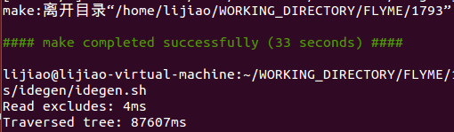

# 新员工入职指南-环境配置
> 作者：李姣（lijiao1）
<br>修改时间：2017-07-14

## 第一章 Win7下安装Ubuntu
&emsp;&emsp;请参考博客：[Win7下安装Ubuntu](http://blog.csdn.net/lj1404536198/article/details/77074192)

## 第二章 下载源码
>此章编写参考了：
<br>http://redmine.meizu.com/documents/2347
<br>http://redmine.meizu.com/news/21
<br>鸣谢以上作者 && 欢迎交流指正。

### 2.1 下载google源代码
#### 2.1.1 安装repo
&emsp;&emsp;repo 是一款工具，可让用户在 Android 环境中更轻松地使用 Git。要安装 Repo，请确保主目录下有一个 bin/ 目录，并且该目录包含在路径中：
```shell
    mkdir ~/bin
    PATH=~/bin:$PATH
```
&emsp;&emsp;下载 Repo 工具，并确保它可执行：
```shell
    curl https://storage.googleapis.com/git-repo-downloads/repo > ~/bin/repo
    chmod a+x ~/bin/repo
```
&emsp;&emsp;安装 Repo 后，需要设置客户端以访问 Android 源代码代码库。创建一个空目录来存放工作文件。如果使用的是 MacOS，必须在区分大小写的文件系统中创建该目录。为其指定一个喜欢的任意名称：
```shell
    mkdir WORKING_DIRECTORY
    cd WORKING_DIRECTORY
```
#### 2.1.2 配置
&emsp;&emsp;（如果不需要下载Google源码请直接看小节2.3）
<br>&emsp;&emsp;（1）使用真实姓名和电子邮件地址配置 Git。要使用 Gerrit 代码审核工具，需要一个与已注册的 Google 帐号关联的电子邮件地址。确保这是可以接收邮件的有效地址。在此处提供的姓名将显示在提交的代码的提供方信息中。

    git config --global user.name "Your Name"
    git config --global user.email "Your Name@example.com"
    
&emsp;&emsp;（2）身份验证。默认情况下，访问 Android 源代码均为匿名操作。为了防止服务器被过度使用，每个 IP 地址都有一个相关联的配额。在这种情况下，可以使用进行身份验证的访问方式，此类访问方式会对每位用户使用单独的配额，而不考虑 IP 地址。具体步骤如下：
<br>&emsp;&emsp;在" [google账号][1] "登录，并根据该页面的提示进行操作。
<br>&emsp;&emsp;在terminal中执行上述网页中的下述代码


&emsp;&emsp;（3）运行 repo init 以获取最新版本的 Repo 及其最近的所有错误更正内容。必须为清单指定一个网址，该网址用于指定 Android 源代码中包含的各个代码库将位于工作目录中的什么位置。
<br>&emsp;&emsp;指定 Android 源代码中包含的各个代码库将位于工作目录中的什么位置。

    repo init -u https://android.googlesource.com/a/platform/manifest
    
&emsp;&emsp;要对“master”以外的分支进行校验，请使用 -b 来指定相应分支。（要查看分支列表，请参阅[代号、标记和细分版本 (Build) 号][2])

    repo init -u https://android.googlesource.com/a/platform/manifest -b android-7.1.1_r27

&emsp;&emsp;（目前公司只有Nexus 6P设备，该设备所对应的最新分支为android-7.1.1_r27）

&emsp;&emsp;进行配置时，会出现无法找到repo命令的情况，可通过以下命令解决

    echo 'export PATH=$PATH:$HOME/bin' >> ~/.bashrc
    export PATH=$PATH:$HOME/bin

#### 2.1.3 下载

    repo sync（该源码下载时间较长，基本是8小时左右）
    
### 2.2 下载FLYME源码
#### 2.2.1 开通权限
&emsp;&emsp;在配置ssh的过程中，如果没有相应权限会提示你访问被拒绝；在代码下载过程中，如果没有相应权限也会提示以下信息。


&emsp;&emsp;http://redmine.meizu.com/projects/scm/issues/new?type=statistics
<br>&emsp;&emsp;在上述申请单中填写信息，并指派给配置管理的同事，权限申请参考：
<br>&emsp;&emsp;http://redmine.meizu.com/issues/570523

#### 2.2.2 配置SSH

>`（划重点！！！）`如果在此之前通过repo下载过Google源码，请将ubuntu中所有的repo相关文件删除。

&emsp;&emsp;（1）安装配置git
<br>&emsp;&emsp;安装git完成后，通过以下方式进行配置：

    git config --global user.name "邮箱名前缀"
    git config --global user.email "邮箱名前缀@meizu.com"

&emsp;&emsp;（2）配置SSH Public Key
<br>&emsp;&emsp;几个主要的存放代码的网址，这几个网站都要求在网页端添加SSH Public Key。
    
    http://gitlab.meizu.com/
    http://review.rnd.meizu.com/ 
    http://review.rnd.meizu.com/l/
    http://odc.review.meizu.com/
    http://ma.meizu.com/

&emsp;&emsp;如果想要简单点的话，可以考虑让它们都添加同一个key，但是为了更加安全起见，下面的步骤是以为不同的网站添加不同的key为例。生成ssh key的命令如下，gitlab可以改为任意名字。该命令完成之后将生成一对公私钥分别保存在文件gitlab.pub和文件gitlab中，然后将gitlab.pub文件中的公钥添加到http://gitlab.meizu.com/ 的设置中即可。

    ssh-keygen -t rsa -C "邮箱名前缀@meizu.com" -f ~/.ssh/gitlab
    
&emsp;&emsp;然后不管它提示什么，一路回车，最终会在~/.ssh文件夹下生成密钥（gitlab）和公钥（gitlab.pub）。

    ssh-add ~/.ssh/gitlab

&emsp;&emsp;其他三个网站操作方式同理，而且它们可以考虑使用同一个SSH Key，例如：

    ssh-keygen -t rsa -C "邮箱名前缀@meizu.com" -f ~/.ssh/gerrit
    ssh-add ~/.ssh/gerrit

&emsp;&emsp;（3）配置config
<br>&emsp;&emsp;由于存在多个公私钥，所以上面操作完成之后最好是在~/.ssh/目录下添加一个config文件，配置访问哪个网站的时候使用的是哪个SSH Key。例如：

    Host gitlab.meizu.com gitlab.meizu.com
      IdentityFile ~/.ssh/gitlab
    Host review.rnd.meizu.com review.rnd.meizu.com
      IdentityFile ~/.ssh/gerrit
    Host odc.review.meizu.com odc.review.meizu.com
      IdentityFile ~/.ssh/gerrit
    Host ma.meizu.com ma.meizu.com
      IdentityFile ~/.ssh/gerrit
      
&emsp;&emsp; （4）添加public key
<br>&emsp;&emsp;登录（2）中的网址，点击右上角的sign in,登陆后点击右上角的姓名—>Settings—>左边栏的SSH Public Keys这时候会有一个空白的框框出来让你粘贴key的内容。gitlab.meizu.com填写的是~/.ssh下的gitlab.pub文件中的所有内容，其余网站填写的是gerrit.pub中的内容。添加内容后点击“add”

&emsp;&emsp; （5）测试连接

    ssh -p 29999 邮箱名前缀@review.rnd.meizu.com

&emsp;&emsp;（该测试连接的方式可在添加SSH Public Keys的页面上看到），显示类似下面的内容，说明配置成功

    ****    Welcome to Gerrit Code Review    ****
    
      Hi 李姣, you have successfully connected over SSH.
    
      Unfortunately, interactive shells are disabled.
      To clone a hosted Git repository, use:
    
      git clone ssh://lijiao1@review.rnd.meizu.com:29999/REPOSITORY_NAME.git


&emsp;&emsp;（6）配置known_hosts
<br>&emsp;&emsp;在 http://review.rnd.meizu.com/ 的设置的SSH Public Keys中可以看到Server Host Key，将其复制到~/.ssh/known_hosts文件的末尾即可，其他几个同理
<br>&emsp;&emsp;eg:[review.rnd.meizu.com]:29418 ssh-rsa AAAAB3NzaC1.....

#### 2.2.3下载配置repo
&emsp;&emsp;（1）[下载repo][6]
<br>&emsp;&emsp;（2）将repo文件放置在ubuntu下，以下以放置在~为例（但是最好放在/usr/bin下），并为repo添加权限：
    
    chmod a+x repo
    
&emsp;&emsp;（3）将repo配置到path中

    export PATH=~/:$PATH
    
&emsp;&emsp;（4）将repo工具文件的第一行的REPO_URL 改为下面的形式

    REPO_URL = 'ssh://邮箱名前缀@review.rnd.meizu.com:29999/repo'

&emsp;&emsp;（5）执行$ repo help测试repo工具是否配置正确，一般情况下会输出下面的内容

    usage: repo COMMAND [ARGS]
    
    repo is not yet installed.  Use "repo init" to install it here.
    
    The most commonly used repo commands are:
    
      init      Install repo in the current working directory
      help      Display detailed help on a command
    
    For access to the full online help, install repo ("repo init").

> 补充：
<br>执行repo help时出现
<br>repo: command not found
<br>解决方法为：请检查repo工具文件是否具有 a+x权限

#### 2.2.4 下载代码

&emsp;&emsp;（1）获取代码下载命令
<br>&emsp;&emsp; [分支信息][7]，点击你想下载的分支名称便会有弹框显示分支的详细信息，其中有下载命令，复制下载命令


&emsp;&emsp;（2）下载代码
<br>&emsp;&emsp;在使用repo sync下载代码的时候，可能由于网络不稳定等各种因素导致下载失败显示error: Exited sync due to fetch errors。因此，可以在下载源码的目录下，新建一个文件，例如down.sh，内容如下:

```shell
    #!/bin/bash  
    echo "======start repo sync======"  
    repo sync -c -j8 --no-tag
    while [ $? = 1 ]; do  
    echo "======sync failed, re-sync again======"
    sleep 3  
    repo sync -c -j8 --no-tag
    done  
```
&emsp;&emsp;并cd到下载源码的目录下，执行

    repo init -u ssh://lijiao1@review.rnd.meizu.com:29999/platform/manifest -b M1793_NF6_mp1

&emsp;&emsp;（该命令为（1）中获取的下载命令）

    sh down.sh 
    
&emsp;&emsp;（如果网络稳定，可以直接执行 repo sync -c -j8）
<br>&emsp;&emsp;如果repo sync -c -j8过程中卡住了，适当调低数值，某些台式机只能承受1,-c 参数的含义为指定下载本分支，-j4为指定进程数）
<br>&emsp;&emsp;以下是顺利下载的情形：


&emsp;&emsp;以下是下载成功的情形：


## 第三章 安装配置Android开发环境
### 3.1 安装依赖包
&emsp;&emsp;执行以下命令来更新系统，解决一些依赖包未安装的问题：

    sudo apt-get update && sudo apt-get upgrade
    sudo apt-get install git gnupg flex bison gperf build-essential zip curl libc6-dev libncurses5-dev:i386 x11proto-core-dev libx11-dev:i386 libreadline6-dev:i386 libgl1-mesa-glx:i386 libgl1-mesa-dev g++-multilib mingw32 tofrodos python-markdown libxml2-utils xsltproc zlib1g-dev:i386 u-boot-tools dpkg-dev libswitch-perl lzop;

### 3.2 OpenJdk安装配置
&emsp;&emsp;打开终端，输入命令：

    Java -version
    
&emsp;&emsp;如果出现以下信息，则表示未安装jre


&emsp;&emsp;输入命令:

    javac 
    
&emsp;&emsp;如果出现以下信息，则表示未安装jdk


&emsp;&emsp;android m需要jdk的1.7版本，Android需要jdk的1.8版本支持，因此需要分别进行下载安装，其过程如下：
<br>&emsp;&emsp;步骤1：下载openjdk资源
    
    sudo add-apt-repository ppa:openjdk-r/ppa
    
&emsp;&emsp;步骤2：安装openjdk1.8

    sudo apt-get openjdk-8-jre
    sudo apt-get install openjdk-8-jdk
    
&emsp;&emsp;步骤3：切换默认版本
<br>&emsp;&emsp;由于安装了多个版本的jdk，如果需要设置1.8为默认版本，输入以下命令进行选择
    
    sudo update-alternatives --config java
    sudo update-alternatives --config javac

&emsp;&emsp;切换完成后可通过java -version、javac来确认是否已正确切换。

### 3.3 在ubuntu上安装配置Android studio
#### 3.3.1 下载安装Android  studio
&emsp;&emsp;（1）在[官网][5]（网页下方倒数第二个表格中有Linux版本的 Android studio）下载Linux平台的 zip文件


&emsp;&emsp;（2）并解压缩到应用的相应位置，例如 /usr/local/（适用于用户个人资料）或 /opt/（适用于共享用户）。

    sudo unzip android-studio-ide-162.4069837-linux.zip

&emsp;&emsp;（3）解压出来后文件夹名为android-studio，命令行进入android-studio/bin，执行

    ./studio.sh
    
&emsp;&emsp;会出现以下界面：


&emsp;&emsp;之后 Android Studio 设置向导将指导完成余下的设置，包括下载开发所需的 Android SDK 组件。
<br>&emsp;&emsp;安装完成并打开Android Studio，点击Configure，点击Create Desktop Entry创建桌面快捷方式。

#### 3.3.2 配置Android 环境变量

    gedit ~/.bashrc
    
&emsp;&emsp;在文件的末尾添加如下代码并保存
    
    export ANDROID_HOME=~/Android/Sdk
    export PATH=$ANDROID_HOME/tools:$ANDROID_HOME/platform-tools:$PATH
    
&emsp;&emsp;刷新环境变量
    
    source ~/.bashrc
    
### 3.4 源码导入
&emsp;&emsp;不同于eclipse，源码无法直接通过.classpath文件导入android studio，但是google在发布源码的时候专门给了一个工具用来生成适配androidstudio项目文件的工具。使用方法如下：
<br>&emsp;&emsp;（1）首先cd 到源代码目录下，（如果该源码从未被编译过，那么源码导入之前需要先进行整体编译）执行

    source build/envsetup.sh  
    lunch                 
    make -j4               

&emsp;&emsp;命令的含义分别是
<br>&emsp;&emsp;（载入Android命令）
<br>&emsp;&emsp;（选择编译选项）
<br>&emsp;&emsp;（编译）


&emsp;&emsp;（2）make成功后，执行以下：

    source build/envsetup.sh  
    lunch
    mmm development/tools/idegen
    ./development/tools/idegen/idegen.sh



&emsp;&emsp;这样就会在源码目录下生成android.ipr文件，这个就是android studio的.classpath，然后使用android-studio的open即可打开源码目录！

<br>&emsp;&emsp;（3）因为ide会生成大量索引文件，不仅耗时，而且降低了后面搜索的速度和准确率，因此需要手动去除一些不要的目录，打开源码目录下的android.iml文件，添加以下内容：

    <excludeFolder url="file://$MODULE_DIR$/.repo" />
    <excludeFolder url="file://$MODULE_DIR$/abi" />
    <excludeFolder url="file://$MODULE_DIR$/bootable" />
    <excludeFolder url="file://$MODULE_DIR$/build" />
    <excludeFolder url="file://$MODULE_DIR$/ccu_tool" />
    <excludeFolder url="file://$MODULE_DIR$/commontools" />
    <excludeFolder url="file://$MODULE_DIR$/cts" />
    <excludeFolder url="file://$MODULE_DIR$/dalvik" />
    <excludeFolder url="file://$MODULE_DIR$/developers" />
    <excludeFolder url="file://$MODULE_DIR$/development" />
    <excludeFolder url="file://$MODULE_DIR$/device" />
    <excludeFolder url="file://$MODULE_DIR$/docs" />
    <excludeFolder url="file://$MODULE_DIR$/external" />
    <excludeFolder url="file://$MODULE_DIR$/external/bluetooth" />
    <excludeFolder url="file://$MODULE_DIR$/external/chromium" />
    <excludeFolder url="file://$MODULE_DIR$/external/emma" />
    <excludeFolder url="file://$MODULE_DIR$/external/icu4c" />
    <excludeFolder url="file://$MODULE_DIR$/external/jdiff" />
    <excludeFolder url="file://$MODULE_DIR$/external/webkit" />
    <excludeFolder url="file://$MODULE_DIR$/frameworks/base/docs" />
    <excludeFolder url="file://$MODULE_DIR$/gen" />
    <excludeFolder url="file://$MODULE_DIR$/hardware" />
    <excludeFolder url="file://$MODULE_DIR$/kernel-4.4" />
    <excludeFolder url="file://$MODULE_DIR$/libnativehelper" />
    <excludeFolder url="file://$MODULE_DIR$/ndk" />
    <excludeFolder url="file://$MODULE_DIR$/out" />
    <excludeFolder url="file://$MODULE_DIR$/out/eclipse" />
    <excludeFolder url="file://$MODULE_DIR$/out/host" />
    <excludeFolder url="file://$MODULE_DIR$/out/target/common/docs" />
    <excludeFolder url="file://$MODULE_DIR$/out/target/common/obj/JAVA_LIBRARIES/android_stubs_current_intermediates" />
    <excludeFolder url="file://$MODULE_DIR$/out/target/product" />
    <excludeFolder url="file://$MODULE_DIR$/out_bak" />
    <excludeFolder url="file://$MODULE_DIR$/packages" />
    <excludeFolder url="file://$MODULE_DIR$/pdk" />
    <excludeFolder url="file://$MODULE_DIR$/platform_testing" />
    <excludeFolder url="file://$MODULE_DIR$/prebuilt" />
    <excludeFolder url="file://$MODULE_DIR$/prebuilts" />
    <excludeFolder url="file://$MODULE_DIR$/sdk" />
    <excludeFolder url="file://$MODULE_DIR$/toolchain" />
    <excludeFolder url="file://$MODULE_DIR$/tools" />
    <excludeFolder url="file://$MODULE_DIR$/vendor" />

&emsp;&emsp;（4）设置Android sdk
<br>&emsp;&emsp;选中左侧的“project”，并选中导入的项目，键盘F4打开setting


&emsp;&emsp;点击下图最左侧的“project”，并在project sdk下选择android api版本。


&emsp;&emsp;此时就可以查看源代码了~

### 3.5 执行源码
&emsp;&emsp;（1）源码通过 make或者mmm编译模块后会生成.jar文件（以编译sevices为例）

    source build/envsetup.sh  
    lunch
    make sevices

&emsp;&emsp;（2）通过连接手机，执行：

    adb root
    adb remount
    adb push sevices.jar /system/framework/

### 3.6 常见源码编译错误及解决方法

&emsp;&emsp;[传送门在此][4]

## 第四章 手机固件更新
### 4.1 开通文件服务器访问权限
&emsp;&emsp;Flyme的各个版本在 \\dailybuild\firmware\DailyBuild4Test 路径下，进入深层访问时可能会出现以下问题。


&emsp;&emsp;Flyme组默认是具有文件服务器访问权限的，如果出现此问题可在钉钉上找ITSupport的同事帮忙解决，正常的权限开通可找配置管理的同事。如果未出现该问题，请忽略此小节。

### 4.2下载安装刷机工具并更新手机固件
#### 4.2.1 fastboot 模式刷机
&emsp;&emsp;进入fastboot模式：

    adb reboot bootloader

&emsp;&emsp;查看fastboot模式下，设备是否连接PC：

    fastboot devices

&emsp;&emsp;写入img

    fastboot flash boot boot.img
    fastboot flash system system.img

#### 4.2.2 recovery 模式刷机
1. 将update.zip文件拷贝到手机设备中
2. 关机
3. 长按“power”键和“音量+”键，以进入recovery模式
4. 在recovery模式下对“系统升级”和“清除数据”选项进行选择

#### 4.2.3 flash tool刷机
&emsp;&emsp;请看[教程][3]（注意网址中下载路径的“\\a”应为“\\mzfs”）


[1]:https://www.googlesource.com/new-password?state=android&code=4/2IaIsebt5UPKt4HC4aC01miDdYuRGq_FesoelVq5jNI#
[2]:https://source.android.com/source/build-numbers#source-code-tags-and-builds
[3]:http://redmine.meizu.com/attachments/download/517450/MTK%E5%B9%B3%E5%8F%B0%E7%89%88%E6%9C%AC%E4%B8%8B%E8%BD%BD%E4%BD%BF%E7%94%A8%E6%8C%87%E5%8D%97.pdf
[4]:http://redmine.meizu.com/documents/240
[5]:https://developer.android.com/studio/index.html
[6]:http://redmine.meizu.com/attachments/download/111843/repo
[7]:http://fvcs.rnd.meizu.com/branches


