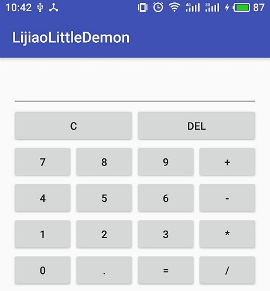

# Android调试与任意Demon
## 第一章 常用的调试快捷键
&emsp;&emsp;F5：一行一行执行，如果遇到自定义方法会进入方法。
<br>&emsp;&emsp;F6：一行行执行，遇到所有方法都不进入。
<br>&emsp;&emsp;F7：跳出当前方法体。
<br>&emsp;&emsp;F8：从当前断点执行到下一个断点。

## 第二章 Demon
布局文件
```xml
<?xml version="1.0" encoding="utf-8"?>
<LinearLayout xmlns:android="http://schemas.android.com/apk/res/android"
    xmlns:app="http://schemas.android.com/apk/res-auto"
    xmlns:tools="http://schemas.android.com/tools"
    android:id="@+id/activity_main"
    android:layout_width="match_parent"
    android:layout_height="match_parent"
    android:paddingBottom="@dimen/activity_vertical_margin"
    android:paddingLeft="@dimen/activity_horizontal_margin"
    android:paddingRight="@dimen/activity_horizontal_margin"
    android:paddingTop="@dimen/activity_vertical_margin"
    android:orientation="vertical"
    tools:context="com.example.lijiao.lijiaolittledemon.MainActivity">

        <EditText
            android:id="@+id/edittext"
            android:gravity="right"
            android:hint=""
            android:layout_width="fill_parent"
            android:layout_height="wrap_content"
            android:selectAllOnFocus="false"
            android:focusable="false"
            android:textAppearance="@style/TextAppearance.AppCompat.Large"
            android:inputType="none"/>
        <LinearLayout
            android:layout_width="fill_parent"
            android:layout_height="wrap_content"
            android:orientation="horizontal">
            <Button
                android:id="@+id/clear"
                android:layout_width="0dip"
                android:layout_height="wrap_content"
                android:layout_weight="1"
                android:text="C"
               />
            <Button
                android:id="@+id/del"
                android:layout_width="0dip"
                android:layout_height="wrap_content"
                android:layout_weight="1"
                android:text="DEL"/>
        </LinearLayout>
        <LinearLayout
            android:layout_width="fill_parent"
            android:layout_height="wrap_content"
            android:orientation="horizontal">
            <Button
                android:id="@+id/seven"
                android:layout_width="0dip"
                android:layout_height="wrap_content"
                android:layout_weight="1"
                android:text="7"/>
            <Button
                android:id="@+id/eight"
                android:layout_width="0dip"
                android:layout_height="wrap_content"
                android:layout_weight="1"
                android:text="8"/>
            <Button
                android:id="@+id/nine"
                android:layout_width="0dip"
                android:layout_height="wrap_content"
                android:layout_weight="1"
                android:text="9"/>
            <Button
                android:id="@+id/plus"
                android:layout_width="0dip"
                android:layout_height="wrap_content"
                android:layout_weight="1"
                android:text="+"/>
        </LinearLayout>
        <LinearLayout
            android:layout_width="fill_parent"
            android:layout_height="wrap_content"
            android:orientation="horizontal">
            <Button
                android:id="@+id/four"
                android:layout_width="0dip"
                android:layout_height="wrap_content"
                android:layout_weight="1"
                android:text="4"/>
            <Button
                android:id="@+id/five"
                android:layout_width="0dip"
                android:layout_height="wrap_content"
                android:layout_weight="1"
                android:text="5"/>
            <Button
                android:id="@+id/six"
                android:layout_width="0dip"
                android:layout_height="wrap_content"
                android:layout_weight="1"
                android:text="6"/>
            <Button
                android:id="@+id/minus"
                android:layout_width="0dip"
                android:layout_height="wrap_content"
                android:layout_weight="1"
                android:text="-"/>
        </LinearLayout>
        <LinearLayout
            android:layout_width="fill_parent"
            android:layout_height="wrap_content"
            android:orientation="horizontal">
            <Button
                android:id="@+id/one"
                android:layout_width="0dip"
                android:layout_height="wrap_content"
                android:layout_weight="1"
                android:text="1"/>
            <Button
                android:id="@+id/two"
                android:layout_width="0dip"
                android:layout_height="wrap_content"
                android:layout_weight="1"
                android:text="2"/>
            <Button
                android:id="@+id/three"
                android:layout_width="0dip"
                android:layout_height="wrap_content"
                android:layout_weight="1"
                android:text="3"/>
            <Button
                android:id="@+id/product"
                android:layout_width="0dip"
                android:layout_height="wrap_content"
                android:layout_weight="1"
                android:text="*"/>
        </LinearLayout>
        <LinearLayout
            android:layout_width="fill_parent"
            android:layout_height="wrap_content"
            android:orientation="horizontal"
            android:layout_marginBottom="0dp">
            <Button
                android:id="@+id/zero"
                android:layout_width="0dip"
                android:layout_height="wrap_content"
                android:layout_weight="1"
                android:text="0"/>
            <Button
                android:id="@+id/dot"
                android:layout_width="0dip"
                android:layout_height="wrap_content"
                android:layout_weight="1"
                android:text="."/>
            <Button
                android:id="@+id/equals"
                android:layout_width="0dip"
                android:layout_height="wrap_content"
                android:layout_weight="1"
                android:text="="/>
            <Button
                android:id="@+id/divide"
                android:layout_width="0dip"
                android:layout_height="wrap_content"
                android:layout_weight="1"
                android:text="/"
                />
        </LinearLayout>
    </LinearLayout>

```

mainActivity

```java
package com.example.lijiao.lijiaolittledemon;

import android.support.v7.app.AppCompatActivity;
import android.os.Bundle;
import android.view.View;
import android.widget.Button;
import android.widget.EditText;
import java.util.Stack;


//该demon为实现计算器简单功能的小程序，并未检查用户输入的合法性。

public class MainActivity extends AppCompatActivity implements View.OnClickListener{

    private Button btn_equals,btn_clear,btn_del,btn_seven,btn_eight,btn_nine,
            btn_minus,btn_four,btn_five,btn_six,btn_plus,btn_one,btn_two,
            btn_three,btn_zero,btn_dot,btn_divide,btn_product;
    private EditText ediText;//显示输入的数字
    private Stack<Integer> opt = new Stack<Integer>();
    private Stack<Double> num = new Stack<Double>();
    @Override
    protected void onCreate(Bundle savedInstanceState) {
        super.onCreate(savedInstanceState);//初始化
        setContentView(R.layout.activity_main);//填充屏幕UI
        btn_one = (Button) findViewById(R.id.one);
        btn_two = (Button) findViewById(R.id.two);
        btn_plus = (Button) findViewById(R.id.plus);
        btn_equals = (Button) findViewById(R.id.equals);
        btn_clear = (Button) findViewById(R.id.clear);
        btn_product= (Button) findViewById(R.id.product);
        btn_del = (Button) findViewById(R.id.del);
        btn_seven = (Button) findViewById(R.id.seven);
        btn_eight= (Button) findViewById(R.id.eight);
        btn_nine = (Button) findViewById(R.id.nine);
        btn_minus = (Button) findViewById(R.id.minus);
        btn_four = (Button) findViewById(R.id.four);
        btn_five = (Button) findViewById(R.id.five);
        btn_six = (Button) findViewById(R.id.six);
        btn_three = (Button) findViewById(R.id.three);
        btn_zero = (Button) findViewById(R.id.zero);
        btn_dot = (Button) findViewById(R.id.dot);
        btn_divide = (Button) findViewById(R.id.divide);

        ediText = (EditText)findViewById(R.id.edittext);

        btn_one.setOnClickListener(this);//如果没有加implements View.OnClickListener{，该语句会导致app闪退,why?
        btn_two.setOnClickListener(this);
        btn_plus.setOnClickListener(this);
        btn_equals.setOnClickListener(this);
        btn_clear.setOnClickListener(this);
        btn_product.setOnClickListener(this);
        btn_del.setOnClickListener(this);
        btn_seven.setOnClickListener(this);
        btn_eight.setOnClickListener(this);
        btn_nine.setOnClickListener(this);
        btn_minus.setOnClickListener(this);
        btn_four.setOnClickListener(this);
        btn_five.setOnClickListener(this);
        btn_six.setOnClickListener(this);
        btn_three.setOnClickListener(this);
        btn_zero.setOnClickListener(this);
        btn_dot.setOnClickListener(this);
        btn_divide.setOnClickListener(this);
    }

    public void onClick(View v) {
            switch (v.getId())
            {
                case R.id.zero://0
                {
                    String str = ediText.getText().toString()+"0";
                    ediText.setText(str);
                    break;
                }
                case R.id.one://1
                {
                    String str = ediText.getText().toString()+"1";
                    ediText.setText(str);
                    break;
                }
                case R.id.two://2
                {
                    String str = ediText.getText().toString()+"2";
                    ediText.setText(str);
                    break;
                }
                case R.id.three://3
                {
                    String str = ediText.getText().toString()+"3";
                    ediText.setText(str);
                    break;
                }
                case R.id.four://4
                {
                    String str = ediText.getText().toString()+"4";
                    ediText.setText(str);
                    break;
                }
                case R.id.five://5
                {
                    String str = ediText.getText().toString()+"5";
                    ediText.setText(str);
                    break;
                }
                case R.id.six://6
                {
                    String str = ediText.getText().toString()+"6";
                    ediText.setText(str);
                    break;
                }
                case R.id.seven://7
                {
                    String str = ediText.getText().toString()+"7";
                    ediText.setText(str);
                    break;
                }
                case R.id.eight://8
                {
                    String str = ediText.getText().toString()+"8";
                    ediText.setText(str);
                    break;
                }
                case R.id.nine://9
                {
                    String str = ediText.getText().toString()+"9";
                    ediText.setText(str);
                    break;
                }
                case R.id.dot://.
                {
                    String str = ediText.getText().toString()+".";
                    ediText.setText(str);
                    break;
                }
                case R.id.plus://+
                {
                    String str = ediText.getText().toString()+"+";
                    ediText.setText(str);
                    break;
                }
                case R.id.minus://-
                {
                    String str = ediText.getText().toString()+"-";
                    ediText.setText(str);
                    break;
                }
                case R.id.product://*
                {
                    String str = ediText.getText().toString()+"*";
                    ediText.setText(str);
                    break;
                }
                case R.id.divide:// /
                {
                    String str = ediText.getText().toString()+"/";
                    ediText.setText(str);
                    break;
                }
                case R.id.equals:// =
                {
                    try {
                        String str = ediText.getText().toString();
                        double output = Caculate(str + "=");
                        if(Math.abs(output-(int) (output)) <=0.000000001)
                            ediText.setText( (int) (output)+ "");
                        else ediText.setText( output+ "");
                    }
                    catch(Exception e){
                    ediText.setText("failed");
                    }
                    break;
                }
                case R.id.clear:
                {
                    ediText.setText("");
                    break;
                }
                case R.id.del:
                {
                    String str = ediText.getText().toString();
                    ediText.setText(str.substring(0,str.length()-1));
                    break;
                }
            }


    }


    public int GetOptNum(String opt)
    {
        switch (opt)
        {
            case "+":
                return 0;
            case "-":
                return 1;
            case "*":
                return 3;
            case "/":
                return 4;
            case "=":
                return -1;
        }
        ediText.setText("GetOptNum analysis failed!");
        return -4;
    }

    public void GetCalAB(int topt){
        switch(topt+"")
        {
            case "0":
            {
                double numB = num.pop();
                double numA = num.pop();
                num.push(numA + numB);
                break;
            }
            case "1":
            {
                double numB = num.pop();
                double numA = num.pop();
                num.push(numA - numB);
                break;
            }
            case "3":
            {
                double numB = num.pop();
                double numA = num.pop();
                num.push(numA * numB);
                break;
            }
            case "4":
            {
                double numB = num.pop();
                double numA = num.pop();
                num.push(numA / numB);
                break;
            }
        }
    }
    public double Caculate(String content){
        String s = "";
        for(int i=0;i<content.length();i++)
        {
            if((content.charAt(i) >= '0' && content.charAt(i) <='9')|| content.charAt(i)=='.')
                s = s + content.charAt(i);
            else
            {
                int Now_opt = GetOptNum(content.charAt(i)+"");//当前运算符
                num.push(Double.parseDouble(s));//数字进栈
                if(opt.isEmpty())
                    opt.push(Now_opt);
                else
                {
                    int Top_opt = opt.peek();//上一个运算符
                    while(Now_opt - Top_opt < 2)//如果当前运算符的优先级小于栈顶运算符的优先级，则出栈数字和运算符进行计算
                    {
                        GetCalAB(opt.pop());
                        if(opt.isEmpty())//如果当前运算符为“=”，则停止运算病返回运算结果
                            break;
                        else Top_opt = opt.peek();
                    }
                    if(opt.isEmpty() && Now_opt==-1)
                        return num.pop();
                    else opt.push(Now_opt);
                }
                s = "";
            }

        }
        return 0;
    }


}
/**
 * test case
 1+4-2
 1-4+2
 1*4/2
 1/4*2
 1+4/2
 1*4-2
 4/2-4/2+1
 4*2+4*2-1
 小数点同上
 **/
```
界面



## 第三章 Demon编写过程中的疑问
（1）为什么class MainActivity中有oncreate方法，在该方法中还要调用super.oncreate（）方法？
>&emsp;&emsp; 因为MainActivity的父类中的oncreate方法也实现了一些基本操作，如果不调用父类的oncreate方法，当前oncreate方法可能因为缺失功能而报错。

（2）为什么是oncreate方法中有参数Bundle savedInstanceState，而不是在onRestart方法中？
> &emsp;&emsp;当activity调用onPause()和onStop()方法时，activity仍处于内存中，状态和数据信息不会丢失，当activity回到前台，所有的信息将会得到保留。但是如果内存不足，当activity调用onPause()和onStop()方法后，activity就会被销毁，此时需要对状态和数据信息通过onSaveInstanceState()方法进行保存，并传递给oncreate方法。当用户通过back销毁activity时，activity的状态并不会被保存。
<br>&emsp;&emsp;某些系统设置的改变（屏幕旋转、语言等）也会导致activity的摧毁和重建。

（3）public class MainActivity extends AppCompatActivity下的btn_two.setOnClickListener(this)显示类型报错为什么？
```java
 btn_two.setOnClickListener()参数要求的类型是View.OnClickListener，而this是MainActivity，OnClickListener定义为：
public interface OnClickListener {
        void onClick(View var1);
}
因此通过implements View.OnClickListener使得MainActivity 的类型属于View.OnClickListener，并重写onClick方法。
```

（4）为什么在MainActivity中只实现了oncreate方法，生命周期中的其他方法呢？
>&emsp;&emsp; MainActivity的父类中实现了生命周期中的其他方法，MainActivity可以直接使用，如果需要添加功能可重写方法。

（5）findViewById的作用是什么？
> 返回XML文件中控件的ID，以便在程序中引用。