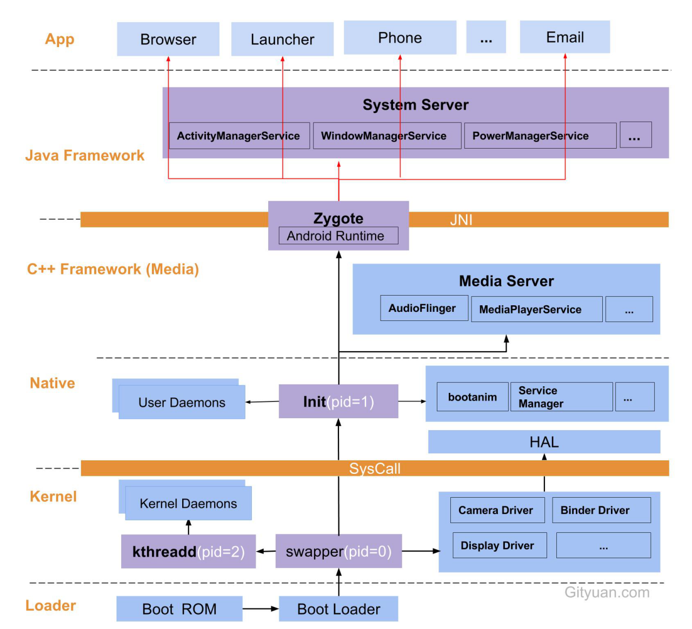

# Android启动流程

&emsp;&emsp;Android是基于linux系统开发而成的，其中针对移动设备的特性进行了调整，所以android系统大体上可以分为linux内核空间和用户空间。在系统启动时，会先启动linux内核。整个启动步骤分为6个部分。

&emsp;&emsp;当按下电源键，**引导芯片**开始从固化在ROM的代码开始执行，加载引导程序到RAM。

 &emsp;&emsp;接下来**执行BootLoader**。BootLoader是操作系统内核运行前的一小段程序，即引导程序，通过引导程序检查RAM、初始化硬件参数、加载内核和内存空间映射图、跳转到内核。

 &emsp;&emsp;BootLoader执行结束跳转到内核。内核模块会启动swapper进程，swapper（交换进程，pid=0）是所有进程的父进程，该进程负责内核的初始化。Swapper进程启动kthreadd进程（内核进程，pid=2），kthreadd是所有内核进程的父进程，该进程将会软中断内核守护进程，并启动内核工作线程。

 &emsp;&emsp;在内核启动结束后，会跳转到native层，native层首先启动的是init进程，Init（用户进程，pid=1）创建将会守护进程，这些守护进程启动后会初始化其相应的模块，这些守护进程包括ueventd、logd、healthd、installd、adbd、lmkd等；同时init会启动开机动画（bootanim）、service manager（binder 服务管家）等服务；native层还包括HAL，HAL将内核层的驱动程序进行封装并为上层提供接口。

 &emsp;&emsp;Native层启动结束后，Init进程会创建media server进程和zygote进程（app进程的父进程），该进程负责C++ framework的启动和管理。Init启动c++ framework层的Runtime运行时服务（将中间静态代码编译成本地代码）。Init进程使用app_process命令来通过android runtime启动第一个ART虚拟机，并调用zygote的main方法。

 &emsp;&emsp;为了加速app的启动，Zygote进程接下来会加载zygoteinit类、注册zygote socket、预加载app在运行时所需的class文件和资源到系统RAM中、加载虚拟机。Zygote会监听其socket（/dev/socket/zygote）来判断是否需要启动app。当监听到需要创建app的请求时，就会fork一个app进程。这样的好处在于app启动所需要的class和资源被zygote预加载完成，就不需要动态地在启动时加载。

 &emsp;&emsp;system server是由zygote fork出的第一个进程，该进程负责java framework的启动和管理，启动system server后，其他系统服务将自己注入到system server中，同时其他系统服务也完成启动，这些服务包括Power Manager,Telephony Registry,Battery Service,Window Manager等等，在这其中也包括我们熟知的 Activity Manager。

 &emsp;&emsp;最终，zygote会创建第一个app 进程launcher，这是用户看到的桌面app，zygote还会创建Browser、Phone、Email等app进程，所有的app进程都是由zygote进程fork生成的。

 &emsp;&emsp;在android中fork zygote进程很高效，这是因为linux kernel 采用了copy-on-write的技术。Copy-on-write的意识是只有写的时候才单独复制一份，读的时候并不进行任何操作，换言之fork zygote实际上并没有复制什么东西，只有在发生写操作时，才单独复制一份。而另一方面，class文件和resource资源文件并不需要重新写，这些文件在绝大多数时候都是只读的。最后，实际效果就是尽管运行着多个app，但实际上只有一份class和resource文件在zygote进程中。
