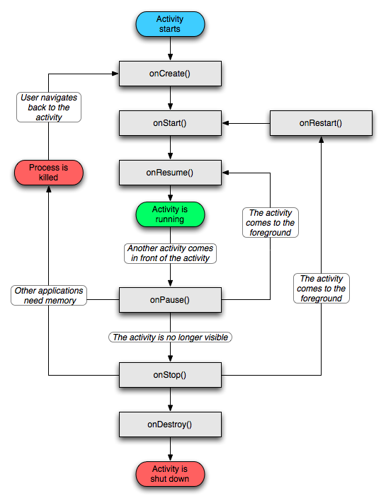
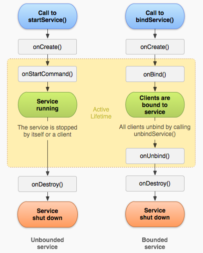

# Android 四大组件
## 第一章 各组件简介
&emsp;&emsp;（1）Activity
 &emsp;&emsp;一个acticity就是一个单独的窗口，activity之间通过intent来进行通信，android应用中的每一个activity都需要在androidManifest.xml配置文件中进行说明，否则系统不识别也不执行该activity。

 &emsp;&emsp;（2）Service
 &emsp;&emsp;用于在后台执行用户指定的操作，service的状态有两种：started、bound，当应用程序组件调用startService()方法启动service时，服务处于started状态，当应用程序组件调用bindService()方法绑定到服务时，服务处于bound状态。
 &emsp;&emsp;startService()与bindService()的区别：服务的启动是由其他组件调用startService()启动的，这导致service的onStartCommand（）方法被调用，当service是started状态时，其生命周期与启动它的组件无关，并且可以在后台无限期运行（即使启动service的组件已被销毁），因此，service需要再完成任务后调用stopSelf（）方法停止运行，或由其他组件调用stopService（）方法停止。使用bindService时，组件与service绑定在了一起，调用者一旦退出，服务也就终止了。
 &emsp;&emsp;同样，开发者也需要在程序配置文件中声明全部的service。
 &emsp;&emsp;Service通常在后台运行，不与用户进行直接交互，因此service组件没有图形用户界面，service组件需要继承service基类。Service组件通常用于为其他组件提供后台服务或者监控其他组件的运行。

 &emsp;&emsp;（3）Content provider
 &emsp;&emsp;Android平台提供了content provider让一个应用程序的指定数据集提供给其他应用程序。
 &emsp;&emsp;只有多个应用程序需要共享数据时才需要content provider ，例如，通讯录数据被多个应用程序使用，其数据存储在一个content provider中，content provider能够统一数据访问方式。Content provider是不同的应用程序之间实现数据共享的唯一方式，因为android没有提供应用共同访问的公共存储区。
 &emsp;&emsp;**开发者不会直接使用content provider类的对象**，多数是通过contentResolver对象实现对ContentProvider的操作，其他应用可以通过contentResolver类从该内容提供者中提取或存入数据。
 &emsp;&emsp;Content provider使用URI来唯一标识其数据集，此处的URI以content://作为前缀，表示该数据由ContentProvider来管理。

 &emsp;&emsp;（4） broadcast receiver
 &emsp;&emsp;应用程序可以使用broadcast receiver对外部事件进行过滤，只对感兴趣的外部事件（当电话呼入或者数据网络可用时）进行接收并作出响应。广播接收器没有用户界面，但是它可以启动一个activity或者service来响应它们收到的消息，或者用notificationManager来通知用户。通知有很多种方式，例如，闪动背灯、震动、播放声音等。一般来说是在状态栏上放一个持久的图标，用户可以打开它并获取消息。
 &emsp;&emsp;Broadcast receiver的注册有两种方式，分别是程序动态注册、androidManifest.xml配置文件中进行静态注册。动态注册的特点是当用来注册的activity关掉后，广播也就失效了。静态注册无需担心，只要设备是开启状态，广播接收器也是打开的，哪怕app本身未启动，该app订阅的广播在触发时也会对它起作用。

## 第二章 总结
&emsp;&emsp;四大组件需要注册后才能使用，activity、service、content provider都需要在androidManifest.xml文件中进行声明，而broadcast receiver可以静态注册也可以通过代码动态创建并调用context.registerReceiver（）方式注册至系统。需要注意的是，静态注册的broadcast receiver会随着系统的启动而一直处于活跃状态。

 &emsp;&emsp;四大组件的激活：当接收到contentResolver发出的请求后，content provider被激活，而其他三个组件被一种叫做intent的异步消息激活。

 &emsp;&emsp;四大组件的关闭：content provider在相应contentResolver请求时被激活，broadcast仅在相应广播消息的时候被激活，所以不需要显示地去关闭这些组件。Activity的关闭可以通过调用它的finish（），通过startService（）启动的service要调用Context.stopService（）方法关闭服务，使用bindService（）方法启动的service要调用Context.unbindService（）关闭。

 &emsp;&emsp;Android中的任务：
 &emsp;&emsp;任务其实就是activity栈，它由一个或多个activity组成，共同完成一个完整的用户体验。栈底是启动整个任务的activity，栈顶是当前正在运行与用户交互的activity，点击界面进行跳转时会将activity进行压栈，点击back键是退栈，栈中保存的是对象。
 &emsp;&emsp;任务中的所有activity是作为一个整体进行移动的，整个任务（activity栈）可以移动到前台/退至后台。
 &emsp;&emsp;Android系统是一个多任务的操作系统，可以在听音乐的同时执行其他多个程序。每多执行一个应用程序，就会多消耗一些系统内存，当同时执行的程序过多或者是关闭的程序没有正确释放内存，系统感觉起来会越来越慢，甚至不稳定。为了解决这个问题，android引入了一个新的机制，即生命周期。

## 第三章 生命周期
### 3.1 Activity的生命周期

#### 3.1.1 Activity的三种状态
&emsp;&emsp;Active：当activity位于屏幕前台（栈顶），此时它获取了用户焦点能响应用户的操作，属于活动状态，同一时刻只会有一个activity处于active状态。
 &emsp;&emsp;Paused：当activity失去焦点但仍对用户可见（如在它之上有另一个透明的activity或Toast、AlertDialog等弹出窗口时）它处于paused状态。暂停的activity仍是存活状态（它保留着所有的状态和成员信息，并保持和窗口管理器的连接），但是当系统内存极小时可以被系统杀掉。
 &emsp;&emsp;Stoped：完全被另一个activity遮挡时处于stop状态，它仍然在内存保存着所有的状态和成员信息。只是对用户不可见，当其他地方需要内存时它往往会被系统杀掉。
 &emsp;&emsp;每一个activity都处于某一状态，对于开发者来说，是无法控制其应用程序处于某一状态的，这些均由系统完成。

#### 3.1.2 Activity的七个方法
&emsp;&emsp;onCreate（）：当activity第一次被实例化时系统会调用，整个生命周期只调用一次该方法。通常用户初始化设置，为activity设置所要使用的布局文件，为按钮绑定监听器等静态的设置操作。
 &emsp;&emsp;onStart（）：启动activity，使其用户可见（未获得用户焦点）。
 &emsp;&emsp;onRestart（）：当activity已经停止然后重新被启动时系统会调用。
 &emsp;&emsp;onReume（）：当activity可见时，调用该方法使activity获得用户焦点。
 &emsp;&emsp;onPause（）：用有另一个透明的activity或Toast、AlertDialog等弹出窗口要出现时，调用该方法，该方法使activity可见但不可交互，也用于保存数据。
 &emsp;&emsp;onStop（）：当前activity需要被新的activity完全覆盖不可见时，该方法会被系统调用。
 &emsp;&emsp;onDestroy（）：当activity用户调用finish（）或者系统由于内存不足被系统销毁时系统会调用（整个生命周期只调用一次），用来释放onCreate（）方法中创建的资源，如结束线程等。

#### 3.1.3 Activity的三个周期
&emsp;&emsp;整个生命周期：onCreate（）- onDestroy（）
 &emsp;&emsp;可视化周期：onstart（）- onStop（）
 &emsp;&emsp;前台周期：onResume（）- onPause（）

#### 3.1.3 一个Activity启动的过程
&emsp;&emsp;第一个activity启动的过程：onCreate（）--> onStart（）--> onResume（）
 &emsp;&emsp;当另一个activity启动时：第一个activity onPause（），第二个activity onCreate（）--> onStart（）--> onResume（）--> 第一个activity onStop（）
 &emsp;&emsp;当返回第一个activity时：第二个activity onPause（）-->  第一个activity onRestart（）--> onStart（）--> onResume（）--> 第二个activity onStop（）--> onDestroy（）

### 3.2 Broadcast receiver生命周期
&emsp;&emsp;生命周期只有十秒左右，如果在onReceiver（）内做超过十秒钟内的事情，就会报ANR（application no response）。它的生命周期从onReceiver（）方法开始到该方法返回结果后结束。

### 3.2 Service生命周期
&emsp;&emsp;Service有两种使用方法：
 &emsp;&emsp;调用Context.startService（）启动，并以Contenxt.stopService（）结束；
 &emsp;&emsp;调用Context.bindService（）启动，并以Context.unbindService（）结束。

