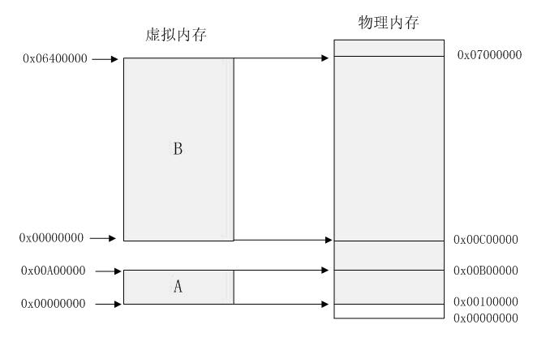
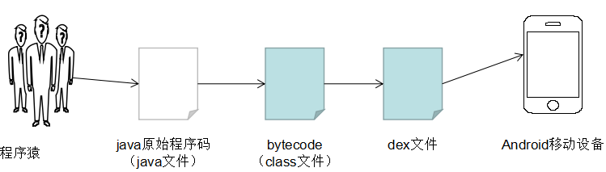

# Android架构概述

&emsp;&emsp;Android架构可以分为两部分：用户空间和linux内核空间。
 &emsp;&emsp;不管是内核空间还是用户空间，它们都处于虚拟空间中。Linux将虚拟地址空间一部分分给内核使用（内核空间），一部分分给用户进程使用（用户空间）。内核空间和内核空间通过系统调用（SysCall）进行通信，用户态进程通过SysCall转化为内核态进程。内核空间中存放的是内核代码、数据，内核空间享有访问硬件设备的所有权限。用户空间中存放的是用户程序的代码和数据，它们只能看到允许它们使用的部分系统资源，并且不能使用某些特定的系统功能，不能直接访问内核空间，不能直接访问硬件等等。这种非对称访问机制保证了系统的安全性。内核空间和用户空间的更多区别与联系可参看[博客《内核空间与用户空间的区别》][1]
 &emsp;&emsp;Linux的虚拟地址空间为0-4G，其中最高的1G供内核使用，较低的3G供各个进程使用，因为用户进程可以通过系统调用进入内核，因此linux内核由系统内的所有进程共享。**每个进程都有自己私有的3G用户空间，该空间对系统中的其他进程是不可见的**（因此进程间通信需要经过内核空间传递）。

&emsp;&emsp;判断一个驱动是用户模式驱动还是内核模式驱动的依据是SysCall，用户空间模式通过SysCall来完成对硬件的访问。
 &emsp;&emsp;上文中说到了虚拟空间，以下对虚拟空间进行简单介绍。
 &emsp;&emsp;在早期的操作系统中，执行程序时会将程序整个装载到内存中，该程序访问的是物理内存，当多个程序运行时，必须保证这些程序所占用的物理内存小于总内存。
 &emsp;&emsp;某台计算机总的内存大小是 128M ，现在同时运行两个程序 A 和 B ， A 需占用内存 10M ， B 需占用内存 110。计算机在给程序分配内存时会采取这样的方法：先将内存中的前 10M 分配给程序 A ，接着再从内存中剩余的 118M 中划分出 110M 分配给程序 B 。这种分配方法可以保证程序 A 和程序 B 都能运行，但是这种简单的内存分配策略问题很多。

&emsp;&emsp;问题1：**地址空间不隔离**。导致内存中的程序有意或者无意地修改其他程序的数据。
 &emsp;&emsp;问题2: **执行效率低**。当内存空间不够但是有新程序需要运行时，内存需要选择一个运行在内存中的程序暂时拷贝其数据到磁盘，以释放部分内存供新程序使用。在这个过程中有大量的数据装入装出，执行效率很低。
 &emsp;&emsp;问题3：**程序运行的地址不确定**。当程序释放出部分内存空间时，操作系统会在剩余的内存中随机选取一段连续的内存空间供新程序使用。由于是随机分配，因此地址空间不确定。
 &emsp;&emsp;操作系统通过在程序和物理内存之间增加一个虚拟地址空间层来间接访问物理内存。32位的操作系统的指针为4字节，其地址为0x00000000-0xFFFFFFFF，其容量为4G的虚拟空间。**每个程序都拥有自己的4G虚拟地址空间**，该空间分为：Null指针区、用户区，64KB禁入区，内核区，用户能直接使用的只有用户区（基本是2G，最大可调整到3G）。操作系统将虚拟地址一一映射到物理内存，实现了地址空间隔离，虚拟地址的空间均是从0x00000000开始，因此也解决了程序运行的地址不确定的问题。此即为分段。

&emsp;&emsp;但执行效率低的问题仍未解决。在分段的映射方法中，内存空间不足以运行时仍需要整个程序的载入载出。实际上，某个时间段内，程序只访问其一小部分数据，也就是说大部分数据在一个时间段内都不会被用到，基于这种情况，人们想到了粒度更小的内存分割和映射方法，即分页。
 &emsp;&emsp;分页的基本方法是，将地址空间分成许多页，页的大小由CPU决定，选择多大的页由操作系统决定。目前inter系列的CPU支持4KB或者4MB的页大小，PC上目前都选择使用4KB，因此4G的虚拟地址空间可分为1048576个页。
 &emsp;&emsp;分段的思想是在程序运行时全部加载到内存，而分页的思想是只加载用到的页，没用到的暂时保留在磁盘上。当用到这些页时再在物理空间中为这些页分配内存然后建立虚拟地址与物理地址的映射。
 &emsp;&emsp;一个可执行文件（PE文件）会被分成很多个页，当PE文件执行时，操作系统先为该文件创建4G的虚拟空间，此处并不是真的创建空间，只是创建用于映射的数据结构，这种数据结构就是页目和页表。创建结束后，进程开始读取文件的第一页。第一页包含了文件头和段表等信息，将PE文件中所有的段一一映射到虚拟地址空间中的页（PE文件中的段长度是页长的整数倍）。这时PE文件的真正指令和数据还未装入内存，操作系统只是根据文件头信息建立映射关系，**当CPU要访问某个页时，首先访问其虚拟地址，发现该虚拟地址没有相应的物理地址，CPU则认为该虚拟地址所在的页面是个空页面，产生了页错误，CPU会将控制权交给操作系统。操作系统为该PE页在物理空间中申请空间，并建立映射，控制权还给进程后，进程从产生错误的地方开始执行。随着页错误的产生，操作系统不断地为进程分配相应的物理页来满足执行需求。**
 &emsp;&emsp;目前操作系统采用的是段页式管理方式。

### 1.1 Linux内核层
&emsp;&emsp;Linux内核层，隐藏了硬件、网络等相关细节，为上层提供一个相对简洁的统一接口，**大部分是与驱动、文件系统、CPU调度、内存管理相关的模块**。驱动包括：USB驱动，camera驱动，蓝牙驱动，WiFi驱动，audio驱动，binder驱动，display驱动，flash驱动。

### 1.2 Libraries层
&emsp;&emsp;Libraries层，是一些核心和扩展的类库，它们都是原生的C++编写的，如果该层需要被上层函数调用，就必须通过JNI导出相应的接口函数。
 &emsp;&emsp;（1）Surface manager
> &emsp;&emsp;这是负责显示的模块，当系统执行多个应用程序时，surface manager负责管理界面显示与存取之间的互动，另外也负责将2D绘图与3D绘图进行显示上的合成。

&emsp;&emsp;（2）OpenGLES
> &emsp;&emsp;OpenGL（全写Open Graphics Library）定义了一个跨平台、跨语言的图形程序接口，用于三维图像（二维也行）绘制，是一个功能强大、调用方便的底层图形库。

&emsp;&emsp;（3）SQLit
> &emsp;&emsp;目前主流的移动设备例如iPhone、android等都使用SQLite作为复杂数据的存储引擎，它是一个轻量级的数据库，而且占用的资源非常少，在嵌入式设备中，可能只需要几百kb。

&emsp;&emsp;（4）Media Framework
> 跟多媒体播放相关的一些实现都处于该模块。

&emsp;&emsp;（5）Libc
> &emsp;&emsp;**该模块是libraries中的C函数库，封装了io、文件、socket等基本系统调用。所有的上层调用都需要经过libc封装层。**

&emsp;&emsp;（6）WebKit
> &emsp;&emsp;webKit是一个开源的浏览器网页排版引擎，包含webCore排版引擎和JScore引擎。

&emsp;&emsp;（7）Android 运行时
> &emsp;&emsp;A.core libraries
 &emsp;&emsp;核心函数库，android核心函数库提供的功能大部分与Sun的java核心函数库相同。
 &emsp;&emsp;B.ART
 &emsp;&emsp;一般写好的java程序编译后会产生class文件，而且由JVM（java virtual machine）运行，但是android不使用JVM，而改用Google自主研发的Dalvik VM，所运行的文件是dex文件而不是class，.dex是一种专门为dalvik设计的一种压缩格式，适合内存和处理器有限的系统。在Dalvik VM运行dex文件前，必须使用android开发工具（android SDK）内的dx工具将class文件转换为dex格式，然后交给Dalvik运行，Dalvik比JVM更节能省电更流畅。
 &emsp;

 &emsp;
 &emsp;&emsp;Dalvik一直被诟病为android系统不如IOS流畅的根源，2014年亮相于谷歌I/O大会的Android L改动较大，谷歌直接删除Dalvik，代替它的是传闻已久的ART。
 &emsp;&emsp;ART即android Runtime，ART的机制与Dalvik不同，在Dalvik下应用每次运行的时候都需要将字节码通过即时编译器（just in time，JIT）转为机器码，这会拖慢应用的运行效率，而在ART环境中，应用在第一次安装的时候字节码就会预先编码成机器码，使其成为真正的本地应用。这个过程叫做预编译（Ahead-Of-Time，AOT）。这样的话，应用的启动和执行都会变得更加快速。

###1.3 Framework层
&emsp;&emsp;Framework层，包含所有开发所需的SDK类库，另外还有一些未公开接口的类库和实现，他们是整个android平台核心机制的体现。android系统应用会用到一些隐藏的类，而第三方应用总是基于SDK提供的东西来开发。
 &emsp;&emsp;**FrameWork包含着android大部分的核心机制。**
 &emsp;&emsp;1. View system：android 提供多样化的UI组件，例如按钮、文本框、列表选项等。
 &emsp;&emsp;2. Activity manager：管理activity的生命周期，并提供浏览回溯堆栈（BackStack），让用户可以通过退回键返回上一页。
 &emsp;&emsp;3. Content provider：是多个应用程序共享数据的唯一方式。
 &emsp;&emsp;4. Resource manager：用来访问非程序资源，例如字符串、图形以及页面信息等。
 &emsp;&emsp;5. Notification manager：在状态栏显示指定信息，以通知或提醒用户。
 &emsp;&emsp;6. Windows manager：管理窗口显示的位置。

&emsp;&emsp;什么是java世界？什么是native世界？它们各有什么作用，它们之间是如何交互的？
 &emsp;&emsp;Libaries层提供动态库，例如运行时库、dalvik虚拟机等。从编程语言上看，该层使用C和C++编写，可将其简单地看成是native层。Framework层大部分是java编写的，是java世界的基石。Java世界的运转依赖于native世界，如上图所示。
 &emsp;&emsp;Java虽然具有与平台无关的特性，但是java与具体平台的隔离是通过JNI实现的，JNI通过调用linux OS中的系统来实现相应的功能，例如创建文件等。Native世界为系统的高效稳定运行提供了强有力的支持，一般而言，java世界与native世界通过JNI以IPC的方式进行交互。
 &emsp;&emsp;JNI:用于连接java层和native层，这不是android系统独有的，而是java所有。Java语言是跨平台的语言，跨平台依赖的是java虚拟机，虚拟机采用C/C++编写，适配各个系统，通过JNI为上层java提供各种服务，保证跨平台性。
 &emsp;&emsp;SysCall：内核空间提供给用户空间的一系列接口，允许用户态程序受限地访问硬件设备（申请系统资源、操作设备读写、创建新进程）。SysCall是连接用户态和内核态的桥梁，用户空间通过向内核空间发出SysCall，产生软中断，从而让程序陷入内核态，执行相应的操作。

### 1.4 Application层

&emsp;&emsp;Application层。系统app和第三方app均处于该层。

### 1.5 系统分区

&emsp;&emsp;一般来说，各个厂商在系统上的实现并不一样，android系统分为下面表格中的几个部分。

&emsp;&emsp;Boot：系统引导分区，包含着android内核，系统没有该分区无法启动。这一部分的镜像在boot unlocked模式下，也能够被擦除，但是在这个过程中，不能被打断、关机等，否则会导致系统无法启动。
 &emsp;&emsp;System：android整个系统的所在地，也包含预装的应用。
 &emsp;&emsp;Recovery：备份分区，启动时可进入recovery，然后在这个模式下进行相应的recovery操作。
 &emsp;&emsp;Data：应用程序相关的数据，例如安装的豌豆荚，其数据就放置在data/data/com.wandoujia.phoenix2下面，当恢复出产设置时，第三方应用的数据会被擦除掉
 &emsp;&emsp;Cache：用于存放缓存相关的数据。
 &emsp;&emsp;Misc：存放一些硬件配置、USB配置等信息，如果被擦除可能会导致某些系统设备无法正常工作。

[1]:http://blog.csdn.net/bingqingsuimeng/article/details/7924756

