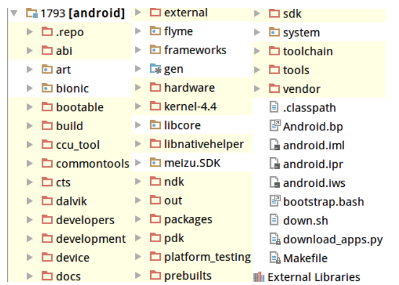

# Android 通信方式简介
## 第一章 Binder

    .repo：repo仓库
    abi:（application binary interface）应用程序二进制接口，生成libabi++.so相关库文件
    art:Google在4.4后加入用来代替dalvik运行时
    bionic:android 的c库
    bootable：启动、引导程序相关代码
    build：存放系统编译规则及generic等开发配置包
    ccu_tool:ccu工具
    commontools:commont工具
    cts:android兼容性测试套件标准
    dalvik：dalvik java虚拟机
    developers:开发者用，存放几个例子
    development：开发者需要的一些例程及工具
    device：设备相关代码，这是各厂商需要需要配置和修改的代码
    docs：介绍开源相关文档
    external：android使用的一些开源库
    flyme：flyme os相对于android原生系统新增的内容
    frameworks：核心框架，java及c++语言
    hardware：部分厂家开源的硬件适配层HAL代码
    kernel-4.4：驱动内核相关代码
    libcore:核心库相关
    libnativehelper:JNI用到的库
    meizu.sdk：自己开发的sdk（原生+自己的）
    ndk：ndk相关
    out:编译完成后的代码输出目录
    packages:应用程序包
    pdk:google用来减少碎片化的东西
    platform_testing：测试用的app
    prebuilts:cpu架构x86和arm下预编译的一些资源
    sdk：sdk及模拟器
    system：底层文件系统库、应用及组件（c语言）
    toolchain：工具链，可用来编辑代码、编译代码、连接操作系统的库
    tools:工具
    vendor：厂商定制代码

