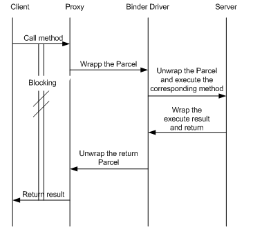
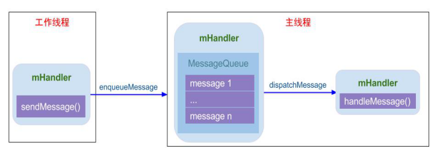

# Android 通信方式简介
## 第一章 Binder
&emsp;&emsp;Binder作为Android系统提供的一种IPC机制，无论从系统开发还是应用开发，都是Android系统中最重要的组成，也是最难理解的一块知识点。深入了解Binder机制，最好的方法便是阅读源码。下面简要说说Binder IPC工作流程。

&emsp;&emsp;binder通信是一种client-server的通信结构：
1. 从表面上来看，是client通过获得一个server的代理接口，对server进行直接调用；
2. 实际上，代理接口中定义的方法与server中定义的方法是一一对应的；
3. client调用某个代理接口中的方法时，代理接口的方法会将client传递的参数打包成为Parcel对象；
4. 代理接口将该Parcel发送给内核中的binder driver；
5. server会读取binder driver中的请求数据，如果是发送给自己的，解包Parcel对象，处理并将结果返回；
6. 整个的调用过程是一个同步过程，在server处理的时候，client会block住。

## 第二章 Socket
&emsp;&emsp;Socket通信方式也是C/S架构，比Binder简单很多。在Android系统中采用Socket通信方式的进程主要有：
 &emsp;&emsp;zygote：用于孵化进程，系统进程system_server孵化进程时便通过socket向zygote进程发起请求；
 &emsp;&emsp;installd：用于安装App的守护进程，上层PackageManagerService很多实现最终都是交给它来完成；
 &emsp;&emsp;lmkd：lowmemorykiller的守护进程，Java层的LowMemoryKiller最终都是由lmkd来完成；
 &emsp;&emsp;adbd：这个也不用说，用于服务adb；
 &emsp;&emsp;logcatd:这个不用说，用于服务logcat；
 &emsp;&emsp;vold：即volume Daemon，是存储类的守护进程，用于负责如USB、Sdcard等存储设备的事件处理。
 &emsp;&emsp;等等还有很多，这里不一一列举，Socket方式更多的用于Android framework层与native层之间的通信。

## 第三章 Handler
&emsp;&emsp;Binder/Socket用于进程间通信，而Handler消息机制用于同进程的线程间通信，Handler消息机制是由一组MessageQueue、Message、Looper、Handler共同组成的，为了方便且称之为Handler消息机制。
 &emsp;&emsp;有人可能会疑惑，为何Binder/Socket用于进程间通信，能否用于线程间通信呢？答案是肯定，对于两个具有独立地址空间的进程通信都可以，当然也能用于共享内存空间的两个线程间通信，这就好比杀鸡用牛刀。接着可能还有人会疑惑，那handler消息机制能否用于进程间通信？答案是不能，Handler只能用于共享内存地址空间的两个线程间通信，即同进程的两个线程间通信。很多时候，Handler是工作线程向UI主线程发送消息，即**App应用中只有主线程能更新UI，其他工作线程往往是完成相应工作后，通过Handler告知主线程需要做出相应地UI更新操作，Handler分发相应的消息给UI主线程去完成，**如下图：

&emsp;&emsp;由于工作线程与主线程共享地址空间，即Handler实例对象mHandler位于线程间共享的内存堆上，工作线程与主线程都能直接使用该对象，只需要注意多线程的同步问题。工作线程通过mHandler向其成员变量MessageQueue中添加新Message，主线程一直处于loop()方法内，当收到新的Message时按照一定规则分发给相应的handleMessage()方法来处理。所以说，而Handler消息机制用于同进程的线程间通信的核心是线程间共享内存空间，而不同进程拥有不同的地址空间，也就不能用handler来实现进程间通信。
 &emsp;&emsp;上图只是Handler消息机制的一种处理流程，是不是只能工作线程向UI主线程发消息呢，其实不然，可以是UI线程向工作线程发送消息，也可以是多个工作线程之间通过handler发送消息。

