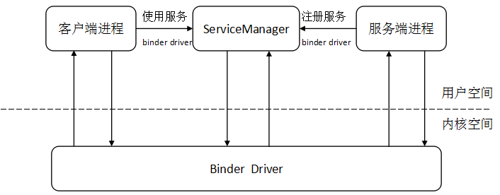
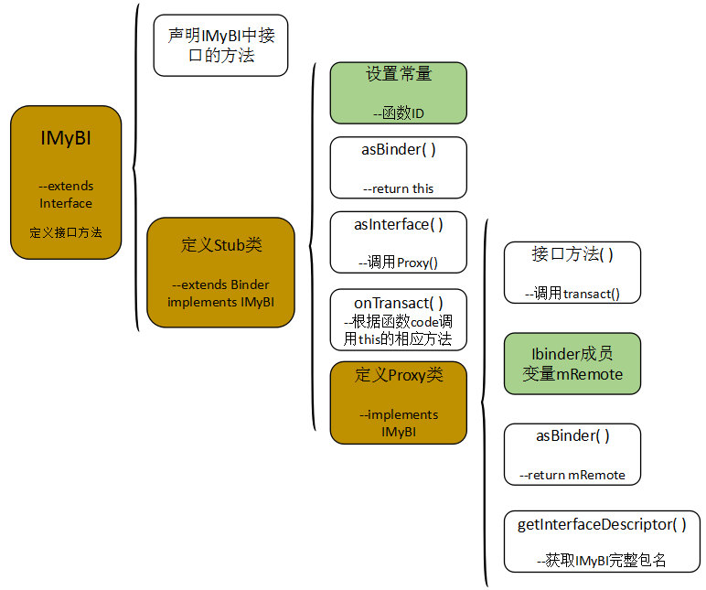
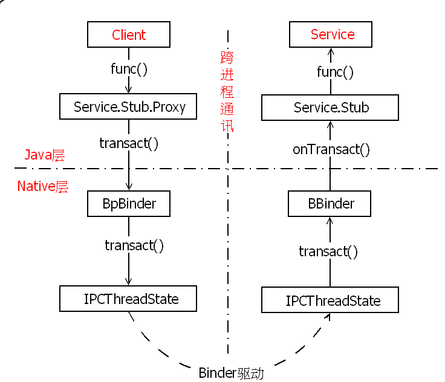
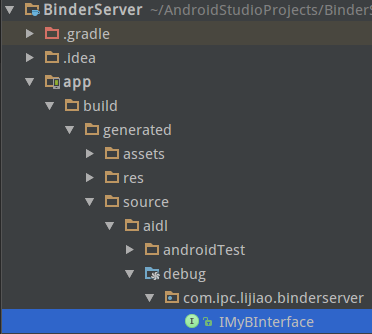

# Binder
## 第一章 Binder基础知识
&emsp;&emsp;socket是一套通用的网络通信方式，其传输效率低下且有很大的开销，比如socket的连接建立过程和中断连接过程都是有一定开销的，在手机这种内存资源比较稀缺的设备上，很明显Socket不适合作为这样的通讯方式。 
<br>&emsp;&emsp;Binder和传统的IPC机制相比，融合了远程调用（RPC）的概念，而且这种远程调用不是传统的面向过程的远程调用，而是一种面向对象的远程调用。Binder很强大也很复杂，无论是调用还是开发一个Binder服务都是一件很轻松的事，Android系统中的服务都是通过Binder构建的。
<br>&emsp;&emsp;Binder是整个系统的中枢，Android在提高Binder的效率也下足了功夫，并且，客户端调用时会发送进程的euid到服务端，因此，服务端可以通过检查客户端的调用进程来决定是否允许其使用调用的服务。



&emsp;&emsp;Binder驱动位于Binder架构的核心，通过文件系统的标准接口向用户层提供服务。应用层和Binder Driver之间的数据交换是通过ioctl（）接口来完成的。Binder Driver的作用主要是：提供通信通道，维护Binder对象的引用计数，转换传输中的Binder实体对象和引用对象，管理数据缓冲区。
<br>&emsp;&emsp;ServiceManager是守护进程，提供Binder服务的查询功能，并返回被查询服务的引用。ServiceManager中有一张表，里面记录了能够注册服务的进程的id，以及进程能够注册的服务名称，ServiceManager通过这张表来控制普通进程的注册请求（android 5.0通过SELinux方法来检查而不是表）。只有root和system进程才可以不受限制地向ServiceManager注册进程。
<br>&emsp;&emsp;SELinux(或SEAndroid)将app划分为主要三种类型(根据user不同，也有其他的domain类型)：
```java
    1. untrusted_app   第三方app，没有Android平台签名，没有system权限
    2. platform_app    有android平台签名，没有system权限
    3. system_app      有android平台签名和system权限
```
&emsp;&emsp;在android 5.0中，由于SELinux的安全机制，即使用户拥有root权限，并且操作的内核节点具有777权限，也不能在JNI层访问（userdebug版本除外）。通过在adb shell中的ps -Z命令可以查看到进程运行在哪一种app类型中，如果想要指定的进程拥有访问权限，需要在类型相应的*.te文件中增加权限。

<br>&emsp;&emsp;Binder服务可以分为实名服务和匿名服务。它们的开发和使用没有区别，唯一的区别是实名服务可以通过ServiceManager查询到。Android中的实名Binder服务都是系统提供的，自己开发的服务是匿名服务。

<br>&emsp;&emsp;匿名服务的启动方式主要有两种：
<br>&emsp;&emsp;（1）某个应用在客户端调用bindService（Intent intent，ServiceConnection sc，flag）向服务端发出intent，服务端创建Binder服务后通过回调onServiceConnected（）方法返回Ibinder对象到客户端，客户端便可使用该引用进行RPC。
<br>&emsp;&emsp;需要注意的是，bindService（）是异步方法，最好为其加锁。

<br>&emsp;&emsp;（2）客户端创建服务，客户端与服务端通过binder连接后，客户端将服务作为参数传递给服务端，Binder Driver在传输途中将实体对象转换为引用对象，这样服务端就能使用客户端的服务了。

<br>&emsp;&emsp;在android工程下建立AIDL文件，并在其中定义接口IMyBI，通过Build->make project，会由AIDL文件自动生成java代码。对该代码进行分析后，总结出以下结构图：



&emsp;&emsp;客户端使用的是Proxy对象，客户端调用Proxy对象的接口方法时，该接口方法使用transact（）方法来发起RPC（远程调用）请求，此时客户端的线程会挂起等待服务端的返回值，如果所调用的服务端方法较为耗时，就不要在UI main线程中发起该请求，否则会发生ANR。

<br>&emsp;&emsp;基于binder的进程间通信流程为：

1. Client 发起远程调用请求也就是RPC 到Binder。同时将自己挂起，挂起的原因是要等待RPC调用结束以后返回的结果。
2. Binder 收到RPC请求以后把参数收集一下，调用transact方法，把RPC请求转发给service端。
3. service端收到rpc请求以后就去线程池里找一个空闲的线程去走service端的 onTransact方法，实际上也就是真正在运行service端的方法了，等方法运行结束就把结果写回到binder中。
4. Binder收到返回数据以后就唤醒原来的Client线程，返回结果。至此，一次进程间通信的过程就结束了。



&emsp;&emsp;虽然Binder服务的远程调用时同步的，但是服务端的onTransact（）方法是运行在线程池中的，这意味着，当客户端多个线程使用服务端的方法时，服务端中的方法使用的参数需要能够支持异步，也就是说，Binder方法（自己定义的接口方法）需要同步。

## 第二章 学习Binder的过程中产生的疑问：
<br>&emsp;&emsp;（1）应用层和binder驱动进行数据交换是通过ioctl（）实现，为什么不通过write实现？
> &emsp;&emsp;int ioctl(int fd, ind cmd, …)；
<br>&emsp;&emsp;如果驱动程序提供了对ioctl的支持，那么用户就可以在应用程序中通过ioctl对设备文件的I/O通道进行控制，ioctl对I/O进行控制管理，主要是控制设备的一些特性，例如串口（数据一位一位地顺序传送）的传输波特率、马达的转速等。应用程序中只通过命令码（cmd）告诉驱动程序它想做什么（测试物理连接，调节音量），命令码对应的动作定义在驱动程序中的case中。因此ioctl也可以做一些如同wirte和read的操作，write和ioctl分开的目的是为了分工明确，wirte写数据，ioctl管理I/O通道，ioctl会实现哪些I/O功能取决于驱动代码中命令码对应什么工作。
<br>&emsp;&emsp;linux中的struct file_operations 中定义了对设备文件进行操作的函数，例如write。但是有些操作是在其中找不到对应的函数的，例如弹出CD光驱，该操作并不是所有的设备文件操作都会用到，因此file_operations中不会有对应的函数，因此linux就把一些没办法归类的函数放在ioctl中，通过指定的命令来执行不同的操作。
<br>&emsp;&emsp;binder是通过ioctl来实现应用层和驱动层的数据交换的，不使用wirte和read是因为binder的数据交换过程比较复杂，而且还涉及两个进程间的数据传输，如果使用两个不同接口来实现就更为复杂了，但是使用ioctl能够实现通过一次系统调用来实现双向的数据交换，不仅简化了逻辑，还提高了传输效率。

&emsp;&emsp;（2）service，SystemServer，ServiceManager之间的关系
>&emsp;&emsp; ServiceManager是一个守护进程，提供对service的查询功能，并返回service的引用对象。service通过ServiceManager在SystemServer.java中addService之后，service就能够成为一个SystemServer，在android系统启动时就和其他的SystemServer一直运行在后台。

<br>&emsp;&emsp;（3）aidl文件产生的源文件的作用。

<br>&emsp;&emsp;（4）ServiceManager是如何成为一个守护进程的？即ServiceManager如何告知驱动程序它是binder机制的管理者？

<br>&emsp;&emsp;（5）Server和Client是如何获得ServiceManager接口的？即defaultServiceManager接口是如何实现的。
<br>&emsp;&emsp;（6）server是如何将自己的service启动起来的？ServiceManager在server的启动过程中是如何为server提供服务的？即ServiceManager::addService接口是如何实现的。
<br>&emsp;&emsp;（7）ServiceManager是如何为Client提供服务的？即ServiceManager::getService接口是如何实现的。

## 第三章 Demon
### 3.1 服务端
（1）新建一个AIDL文件，并定义一个binder接口
```java
package com.ipc.lijiao.binderserver;
// Declare any non-default types here with import statements
interface IMyBInterface {
    /**
     * Demonstrates some basic types that you can use as parameters
     * and return values in AIDL.
     */
    String retrunMessage(String m);
    int computeAdd(int a,int b);
}
```

（2）通过点击工具栏中的“Build->make project”，此时会在project视图下看到android 自动生成的java文件



（3）定义服务

```java
package com.ipc.lijiao.binderserver;

/**
 * Created by lijiao on 17-8-17.
 */
import android.app.Service;
import android.content.Intent;
import android.os.IBinder;
import android.os.RemoteException;
import android.util.Log;

public class MyService extends Service {

    IMyBInterface.Stub bn = new IMyBInterface.Stub() {
        @Override
        public String retrunMessage(String m) throws RemoteException {
            Log.i("MyService",m);
            return "MyService"+m;
        }
        @Override
        public int computeAdd(int a, int b) throws RemoteException {
            return a+b;
        }
    };
    @Override
    public IBinder onBind(Intent intent) {
        return bn;
    }
}
```
（4）注册服务，在manife文件中添加

```xml
 <service
            android:name=".MyService"
            android:exported="true">
            <intent-filter>
                <action android:name="com.lijiao.myService"></action>
            </intent-filter>
        </service>
```

（5）启动服务

```java
package com.ipc.lijiao.binderserver;

import android.content.Intent;
import android.support.v7.app.AppCompatActivity;
import android.os.Bundle;

public class MainActivity extends AppCompatActivity {

    @Override
    protected void onCreate(Bundle savedInstanceState) {
        super.onCreate(savedInstanceState);
        setContentView(R.layout.activity_main);

        Intent intent = new Intent(MainActivity.this,MyService.class);
        startService(intent);
    }
}
```
### 3.2 客户端
&emsp;&emsp;在写客户端的时候需要注意，需要将服务端的aidl文件夹拷贝过来（即aidl文件的上一级文件夹名称是服务端的包名，连同aidl自动生成的java文件），并在客户端的main activity中import 服务端的package。
&emsp;&emsp;否则会报错：
```java
System.err: java.lang.SecurityException: Binder invocation to an incorrect interface
```

&emsp;&emsp;代码

```java
package com.ipc.lijiao.binderclient;

import android.content.ComponentName;
import android.content.Context;
import android.content.Intent;
import android.content.ServiceConnection;
import android.os.Handler;
import android.os.IBinder;
import android.support.v7.app.AppCompatActivity;
import android.os.Bundle;
import android.util.Log;
import android.view.View;
import android.widget.Button;
import android.widget.EditText;

import com.ipc.lijiao.binderserver.IMyBInterface;

public class MainActivity extends AppCompatActivity implements View.OnClickListener{

    EditText show;
    Button send;
    IMyBInterface bnI;
    Handler mhandler = new Handler();
    final  Object lock=new Object();
    String content;
    ServiceConnection sc = new ServiceConnection() {
        @Override
        public void onServiceConnected(ComponentName name, IBinder service) {
            synchronized (lock) {
                bnI = IMyBInterface.Stub.asInterface(service);
          //      if (bnI == null)
          //          Log.i("TEST", "the Connected====>null");
           //     else
           //         Log.i("TEST", "the Connected====>bnI");
                lock.notify();
            }
        }
        @Override
        public void onServiceDisconnected(ComponentName name) {
            bnI = null;
            //Log.i("TEST", ">>the Disconnected");
        }
    };
    @Override
    protected void onCreate(Bundle savedInstanceState) {
        super.onCreate(savedInstanceState);
        setContentView(R.layout.activity_main);
        show = (EditText)findViewById(R.id.show);
        send = (Button)findViewById(R.id.send);
        send.setOnClickListener(this);
    }
    public void onClick(View v) {
        new Thread(new Runnable() {
            @Override
            public void run() {
                Intent intent = new Intent();
                intent.setAction("com.lijiao.myservice");
                intent.setComponent(new ComponentName("com.ipc.lijiao.binderserver","com.ipc.lijiao.binderserver.MyService"));

                bindService(intent, sc, Context.BIND_AUTO_CREATE);
                try {
                        synchronized (lock){
                            if(bnI==null){//判断bni为空才lock是因为，有可能bindservice（）有时候执行速度快，到此处启动服务端的进程已经连接上并返回结果了
                            lock.wait();
                            }
                        }
                    } catch (InterruptedException e) {
                        e.printStackTrace();
                    }
                content = clientRetrunMessage(show.getText().toString());
                mhandler.post(new Runnable() {
                    @Override
                    public void run() {
                        Log.i("MainActivity", " mhandler.post");
                        show.setText(content);
                    }
                });
            }
        }).start();
    }

    public String  clientRetrunMessage(String content)
    {

        try {
            return bnI.retrunMessage(content);
        } catch (Exception e) {
            e.printStackTrace();
        }
        return null;
    }

    public void onDestroy()
    {
       // Log.i("TEST", "onDestroy");
        unbindService(sc);
        super.onDestroy();
    }
}
```


