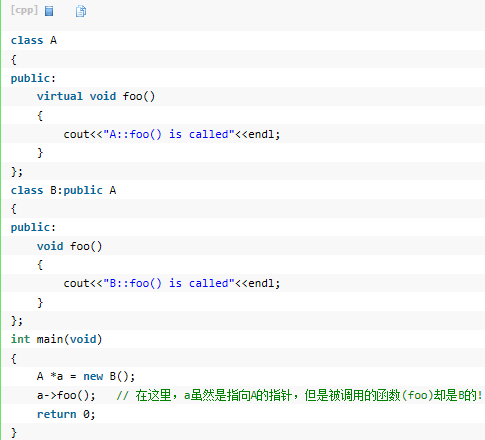
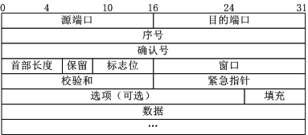
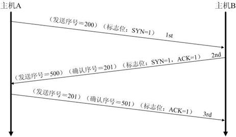
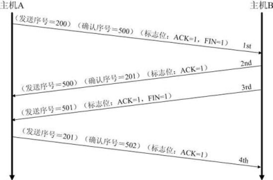

# 周边学习
一、final

1. final变量：是只读的，经常和static一起使用，来定义常量。
2. final方法：不可以被子类重写，编译时被静态绑定。
3. final类：不能被继承。

<br>二、重载与重写（覆盖）
<br>&emsp;&emsp; 类中可以存在多个同名但不同参数列表的函数（返回值类型不做特别要求），这叫重载，是多态性的一种表现。调用函数时，根据参数来决定调用哪一个同名参数，这就是多态。
<br>&emsp;&emsp; 重写要求函数名+参数列表+返回值相同。子类中重写方法的访问限制符的范围不能小于父类方法，重写方法不能抛出新异常或者是捕捉更大范围的异常。父类方法被默认访问权限修饰时，只能在同一包内被子类重写。如果父类方法被protected，该方法可在不同包内被重写。

<br>三、多态
<br>&emsp;&emsp;重写、重载、虚函数

<br>四、纯虚函数与虚函数
<br>&emsp;&emsp;定义一个虚函数，能够允许基类使用指针来调用子类的该函数（并不代表是不被实现的函数）。



&emsp;&emsp;（如果不指定父类的函数为虚函数，那么输出的将会是“A::foo() is called”）
<br>&emsp;&emsp;虚函数也是多态。重载的多态是通过参数列表来决定调用哪一个函数，而虚函数（还有重写）是通过虚函数所属于的类的实例对象来决定调用哪一个函数。
<br>&emsp;&emsp;定义一个纯虚函数，子类继承包含该纯虚函数的父类时，必须实现该函数。纯虚函数只是在类中声明函数名并以virtual修饰，函数名后赋值0，例如：
```c
virtual void func（）=0；
```
&emsp;&emsp;引入纯虚函数是为了：
<br>&emsp;&emsp;（1）为了方便使用多态性。
<br>&emsp;&emsp;（2）总是通过继承来实现不同功能。动物可以派生出老虎、狮子，但是动物本身生成对象是不合理的。
<br>&emsp;&emsp;纯虚函数所属类为抽象类，不能被实例化，但是可以实例化其派生类（如果派生类只是继承不重写，那么派生类也将是抽象类）。解决了以上两个问题。
<br>&emsp;&emsp;只能将成员函数定义为虚函数（友元不是成员）。析构函数应当是虚函数，但没必要是纯虚函数。

<br>五、C++的三大特性
<br>&emsp;&emsp;继承、多态、封装

<br>六、同步
<br>&emsp;&emsp;（1）同步加锁是为访问同步代码块的对象加锁。
<br>&emsp;&emsp;（2）当前线程访问一个对象中的加锁代码块时，其他线程可以访问该对象中的非加锁的代码块。
<br>&emsp;&emsp;（3）一个对象中有多个加锁的代码块，一个线程访问其中一个加锁代码块时，其他线程不能访问其余加锁代码块。一个对象虽然对其中的多个代码块加锁了，但是锁只有一个，只能同时被一个对象得到。
<br>&emsp;&emsp;synchronized有两种用法：在方法声明中（返回值类型前）、代码块synchronized（this/实例）。
<br>&emsp;&emsp;想要使A方法（该方法又启动线程去调用其他方法，例如B、C）成为阻塞方法的做法是：
```java
（1）object lock = new object（）；//创建一把锁
（2）synchronized（lock）
{
    A（bn）
    if(bn == null)//在此处加判断是因为可能此处线程已经完成全部工作了
    lock.wait();//线程完成了所有工作，则等待
}
（3）在A方法调用的最后一个方法B内
B（）
{
    synchronized（lock）
    {
        if（bn！=null）
        lock.notify();//释放锁
    }
}
```
&emsp;&emsp;更多内容可参阅[网址][1]

<br>七、创建线程的方式
<br>&emsp;&emsp;（1）extends Thread
<br>&emsp;&emsp;（2）implements Runable（可实现共享变量）
<br>&emsp;&emsp;（3）new Thread（线程实例，你想要创建的线程名）
<br>&emsp;&emsp;（4）new Thread（new Runable）                  
<br>&emsp;&emsp;（5）new Thread(new Runable(){},你想要创建的线程名)
<br>&emsp;&emsp;通过implements和extends实现线程的区别[网址1][2]、[网址2][3]。

<br>八、什么时候要在onclick方法中通过线程来处理任务，什么时候不需要。
<br>&emsp;&emsp;整个mainactivity都是主线程，如果一个任务比较耗时，放在工作线程中比较好，否则会使得activity ANR。

<br>九、socket通信中通过Buffered的outputStream和inputStream写数据、读数据和通过定义一个byte数组来发送接收有什么区别？
<br>&emsp;&emsp;outputStream和inputStream不使用缓存使用字节流直接操作，一次传输的字节数据在300字节以内（英文字母占1字节，汉字占2字节）。

<br>十、Handler的post和sendmassage
<br>&emsp;&emsp;参考[网址][4]

十一、三次握手和四次挥手
<br>&emsp;&emsp;TCP报文格式图



&emsp;&emsp;（1）序号：Seq序号，占32位，用来标识从TCP源端向目的端发送的字节流，发起方发送数据时对此进行标记。
<br>&emsp;&emsp;（2）确认序号：ack序号，占32位，只有ACK标志位为1时，确认序号字段才有效，ack=Seq+1。
<br>&emsp;&emsp;（3）标志位：共6个，即URG、ACK、PSH、RST、SYN、FIN，具体含义如下：
<br>&emsp;&emsp;&emsp;（A）URG：紧急指针（urgent pointer）有效。
<br>&emsp;&emsp;&emsp;（B）ACK：确认序号有效。
<br>&emsp;&emsp;&emsp;（C）PSH：接收方应该尽快将这个报文交给应用层。
<br>&emsp;&emsp;&emsp;（D）RST：重置连接。
<br>&emsp;&emsp;&emsp;（E）SYN：发起一个新连接。
<br>&emsp;&emsp;&emsp;（F）FIN：释放一个连接。
<br>&emsp;&emsp; 需要注意的是：
<br>&emsp;&emsp;&emsp;（A）不要将确认序号ack与标志位中的ACK搞混了。
<br>&emsp;&emsp;&emsp;（B）确认方ack=发起方Req+1，两端配对。 





&emsp;&emsp;为什么建立连接是三次握手，而关闭连接却是四次挥手呢？
<br>&emsp;&emsp;这是因为服务端在LISTEN状态下，收到建立连接请求的SYN报文后，把ACK和SYN放在一个报文里发送给客户端。而关闭连接时，当收到对方的FIN报文时，仅仅表示对方不再发送数据了但是还能接收数据，己方也未必全部数据都发送给对方了，所以己方可以立即close，也可以发送一些数据给对方后，再发送FIN报文给对方来表示同意现在关闭连接，因此，己方ACK和FIN一般都会分开发送。
<br>&emsp;&emsp;更多可参考[网址][5]

TODO：

    回调
    访问限制符
    messenger与binder的区别与联系。
    TCP Socket与localSocket


[1]:http://blog.csdn.net/pozmckaoddb/article/details/51472940
[2]:http://blog.csdn.net/great_smile/article/details/42297077
[3]:http://blog.csdn.net/u014746965/article/details/42296475
[4]:http://blog.csdn.net/u013168615/article/details/47024073
[5]:http://uule.iteye.com/blog/2213562


