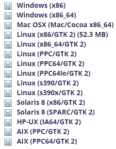

# 了解MAT与Systrace
## 第一章 MAT分析
### 1.1 安装MAT
&emsp;&emsp;下载地址为详见[网址][1]，在网站中有如下版本的MAT：



&emsp;&emsp;版本的选择请查阅[网址][2]。

&emsp;&emsp;MAT可以通过eclipse插件安装，也可以进行独立安装，因为我们使用的是android studio，因此对MAT进行独立安装。解压缩下载的文件后（其实上不需要安装，解压缩就好了），点击以下文件即可打开使用。


### 1.2 MAT案例与使用

activity_main.xml

```xml
<?xml version="1.0" encoding="utf-8"?>
<LinearLayout xmlns:android="http://schemas.android.com/apk/res/android"
    xmlns:app="http://schemas.android.com/apk/res-auto"
    xmlns:tools="http://schemas.android.com/tools"
    android:layout_width="match_parent"
    android:layout_height="match_parent"
    android:orientation="vertical"
    tools:context="com.example.lijiao.matdemon.MainActivity">

    <Button
        android:id="@+id/button1"
        android:layout_width="wrap_content"
        android:layout_height="wrap_content"
        android:text="TestActivity" />

</LinearLayout>
```
activity_test.xml

```xml
<?xml version="1.0" encoding="utf-8"?>
<RelativeLayout xmlns:android="http://schemas.android.com/apk/res/android"
    xmlns:app="http://schemas.android.com/apk/res-auto"
    xmlns:tools="http://schemas.android.com/tools"
    android:layout_width="match_parent"
    android:layout_height="match_parent"

    tools:context="com.example.lijiao.matdemon.TestActivity">
    <TextView
        android:id="@+id/text"
        android:layout_width="wrap_content"
        android:layout_height="wrap_content" />

</RelativeLayout>
```

MainActivity


```java
package com.example.lijiao.matdemon;

import android.support.v7.app.AppCompatActivity;
import android.os.Bundle;

import android.content.Intent;
import android.support.v7.app.AppCompatActivity;
import android.os.Bundle;
import android.view.View;

public class MainActivity extends AppCompatActivity {

    @Override
    protected void onCreate(Bundle savedInstanceState) {
        super.onCreate(savedInstanceState);
        setContentView(R.layout.activity_main);
        findViewById(R.id.button1).setOnClickListener(new View.OnClickListener() {
            @Override
            public void onClick(View v) {
                startActivity(new Intent(MainActivity.this, TestActivity.class));
            }
        });
    }

}
/**
 *
 *
 **/
```
TestActivity 

```java
package com.example.lijiao.matdemon;

import android.support.v7.app.AppCompatActivity;
import android.os.Bundle;

import android.os.Bundle;
import android.os.Handler;
import android.support.v7.app.AppCompatActivity;
import android.util.Log;
import android.view.View;
import android.widget.TextView;

public class TestActivity extends AppCompatActivity {
    private TextView textView;
    private int timer;
    Handler handler = new Handler();

    @Override
    protected void onCreate(Bundle savedInstanceState) {
        super.onCreate(savedInstanceState);
        setContentView(R.layout.activity_test);
        textView = (TextView) findViewById(R.id.text);
        handler.post(new Runnable() {
            @Override
            public void run() {
                textView.setText(String.valueOf(timer++));
                handler.postDelayed(this, 1000);
            }
        });
    }

    protected void onDestroy() {
        super.onDestroy();
       // handler.removeCallbacksAndMessages(null);
      //  handler = null;
    }

}
```
MAT案例以及使用说明请参阅[网址][3]。
内存泄露的必现步骤为：
1. 打开app，点击testActivity
2. 页面跳转到第二个显示页面，点击返回
3. 在android studio中强制gc，并点击java heap 


&emsp;&emsp; 使用Handler案例分析，给出的信息是Thread和android.os.Message，这个Thread和Message配合通常是在Handler使用，结合代码，所以我猜测是Handler导致内存泄漏问题，查看代码，直接就在函数中定义了一个final的Handler用来定时任务，在Activity的onDestroy后，这个Handler还在不断地工作，导致Activity无法正常回收。

### 1.3 疑问
（1）内存泄露是怎么发现的？有些内存泄漏并没有明显的表现。
<br>&emsp;&emsp;APP一个个地试，打开一个app，多抓取几次，查看其占用内存的量是否在不断增长，以发现是否存在内存泄露。

<br>（2）有的学习文档中使用histogram有的使用tree来分析，还有的直接使用Problem Suspect 1来分析，使用哪一个比较好？（案例中使用的是histogram）
<br>&emsp;&emsp;常用histogram，也使用tree。

## 第二章 SysTrace使用
&emsp;&emsp; User版本是不可以抓Trace的，只有ENG版本或者Userdebug版本才可以。
### 2.1 SysTrace简介
<br>&emsp;&emsp;Android4.1以上已经在关键进程和模块添加了Systrace。
<br>&emsp;&emsp;Systrace是Android4.1中新增的性能数据采样和分析工具。它可帮助开发者收集Android关键子系统（如surfaceflinger、WindowManagerService等Framework部分关键模块、服务，View系统等）的运行信息，从而帮助开发者更直观的分析系统瓶颈，改进性能。
<br>&emsp;&emsp;Systrace的功能包括跟踪系统的I/O操作、内核工作队列、CPU负载以及Android各个子系统的运行状况等。

### 2.1 SysTrace图生成
&emsp;&emsp; Android studio安装过程中会自动下载android SDK，SDK中包括了platform-tools，在platform-tools文件夹下可以看到systrace.py文件。
<br>&emsp;&emsp;前提：确保设备通过usb调试选项打开，并成功连接到电脑。

#### 2.2.1 Android Device Monitor生成
1.打开android studio的Tools > Android > Android Device Monitor。


2.点击下图所示的图标。


3.配置trace。


&emsp;&emsp;说明1：trace输出的文件路径
<br>&emsp;&emsp;说明2：配置抓取trace的时间，通常设置为5s或者稍大于5s（便于抓取上下文信息），并在5s内重现问题，时间太短会导致问题重现时抓取不到，时间太长会导致java Heap不够而无法保存，因此在能抓到问题点的情况下，时间越小越好。
<br>&emsp;&emsp;说明3：buffer size是存储systrace的大小，建议设为20480
<br>&emsp;&emsp;说明4：如果用户有自己在应用程序中加入自己的systrace log，例如：
```java
    Trace.beginSection("newInstance");
    Trace.endSection("newInstance");
```    
&emsp;&emsp;那么，选项4必须选择这个应用对应的进程名字，否则新加的systrace log不会被抓到。需要保证 traceBegin与 traceEnd一定要成对出现，并且一定要在同一个线程里面。加入trace的好处在于，生成的trace图中，会在跟踪代码段执行对应的时间轴区间上打上一个tag标记。

<br>&emsp;&emsp;说明5：这部分的tag全部都需要，默认全部被勾选。
<br>&emsp;&emsp;说明6：针对UI相关性能的问题，以下tag需要是必要的
```shell
    Input
    Window Manager
    Activity Manager
    Bionic C Library
    CPU Freq
    CPU Idle
    CPU load
```
&emsp;&emsp;4.设置完成后点击“OK”开始抓取systrace，请在此时重现性能问题，设置的时间到后，trace.html文件会被自动保存下来。
<br>&emsp;&emsp;5.检查systrace是否可用。
<br>&emsp;&emsp;使用chrome浏览器打开保存下来的trace.html。


#### 2.2.2 命令行生成
&emsp;&emsp;命令行启动systrace需要Python，而Ubuntu上默认已安装Python 2.7.6。在android 4.3和大于4.3的版本抓取trace信息
```shell
cd android-sdk/platform-tools/systrace
python systrace.py --time=10 -o mynewtrace.html sched gfx view wm
```

    --time指定trace时间，单位秒
    -o指定输出文件
    sched gfx view wm指定trace的tag，以下是tag参数说明：
    ◦ gfx - Graphics
    ◦ input - Input
    ◦ view - View
    ◦webview - WebView
    ◦ wm - Window Manager
    ◦ am - Activity Manager
    ◦ audio - Audio
    ◦ video - Video
    ◦ camera - Camera
    ◦ hal - Hardware Modules
    ◦ res - Resource Loading
    ◦ dalvik - Dalvik VM
    ◦ rs - RenderScript
    ◦ sched - CPU Scheduling
    ◦ freq - CPU Frequency
    ◦ membus - Memory Bus Utilization
    ◦ idle - CPU Idle
    ◦ disk - Disk input and output
    ◦ load - CPU Load
    ◦ sync - Synchronization Manager
    ◦ workq - Kernel Workqueues Note: Some trace categories are not supported on all devices. Tip: If you want to see the names of tasks in the trace output, you must include the sched category in your command parameters。

&emsp;&emsp;我们一般会把这个命令配置成Alias，配置如下：
```shell
alias st-start='python /home/gaojianwu/Software/android-studio/sdk/platform-tools/systrace/systrace.py'  
alias st-start-gfx-mx4 = ‘st-start -t 8 gfx input view sched freq wm am hwui workq res dalvik sync disk load perf hal rs idle mmc’
```
&emsp;&emsp;这样在使用的时候，可以直接敲 st-start-gfx-mx4 即可，当然为了区分和保存各个文件，还需要加上 -o xxx.Trace .上面的命令和参数不必一次就理解，只需要记住如何简单使用即可，在分析的过程中，这些东西都会慢慢熟悉的。

### 2.3 SysTrace图操作
&emsp;&emsp;请查阅[《使用Systrace图来追踪和优化应用启动速度》][4]

### 2.4 SysTrace图分析
&emsp;&emsp;在每个app进程，都有一个Frames行，正常情况以绿色的圆点表示。当圆点颜色为黄色或者红色时，意味着这一帧超过16.6ms（即发现丢帧），这时需要通过放大那一帧进一步分析问题。对于Android 5.0(API level 21)或者更高的设备，该问题主要聚焦在UI Thread和Render Thread这两个线程当中。对于更早的版本，则所有工作在UI Thread。
<br>&emsp;&emsp;Systrace能自动分析trace中的事件，并能自动高亮性能问题作为一个Alerts，建议调试人员下一步该怎么做。比如对于丢帧是，点击黄色或红色的Frames圆点便会有相关的提示信息；另外，在systrace的最右侧，有一个Alerts tab可以展开，这里记录着所有的的警告提示信息。
<br>&emsp;&emsp;比如下面的提示说你View的draw绘制花的时间太长了，然后我们可以根据Description来很明白的看到提示的内容是什么。比如上面的提示说你View的draw绘制花的时间太长了，然后我们可以根据Description来很明白的看到提示的内容是什么。


&emsp;&emsp;然后我们可以点击一块Frames中的F来查看,同样的它会生成一份跟Alerts类似的报告结果并放在界面的最低端。我们可以通过按下m键查看这一帧到下一帧所花费的时间以及哪个方法被调用的最长。


&emsp;&emsp;可以明显看到这时间>16.6ms，系统要求UI的60fps水准所以系统会报出黄色的警告。照样我们从Description中可以读出到底是哪里出了问题。
<br>&emsp;&emsp;更多内容请参阅[网址][5]。


[1]:http://www.eclipse.org/mat/downloads.php
[2]:https://zhidao.baidu.com/question/22174433.html
[3]:https://github.com/taoweiji/DemoAndroidMemoryLeak
[4]:http://gitlab.meizu.com/Shell/Shell-Docs/blob/master/%E6%98%BE%E7%A4%BA%E4%B8%8E%E6%80%A7%E8%83%BD/JianwuGao/AndroidPerformance_AppLunchTime_Optimize_With_Systrace.md
[5]:http://blog.csdn.net/lamp_zy/article/details/53375521
