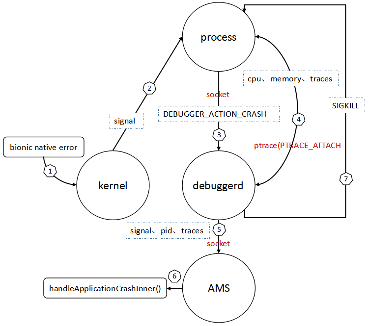
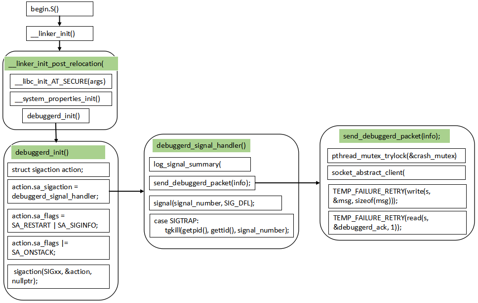
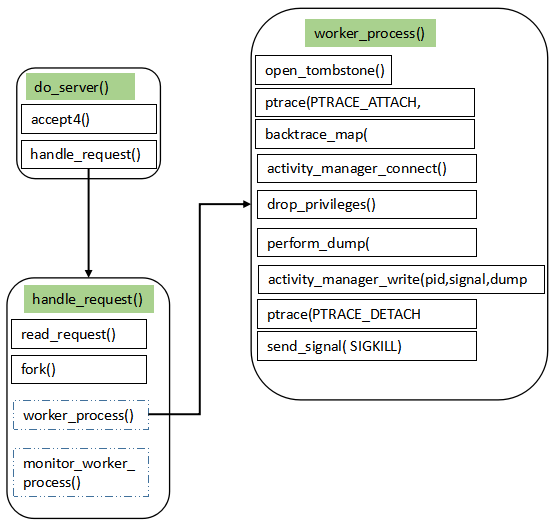
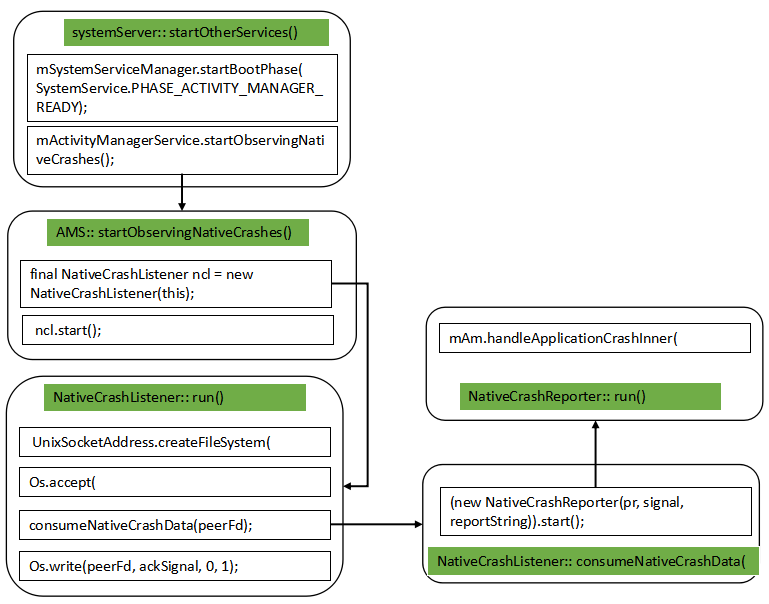
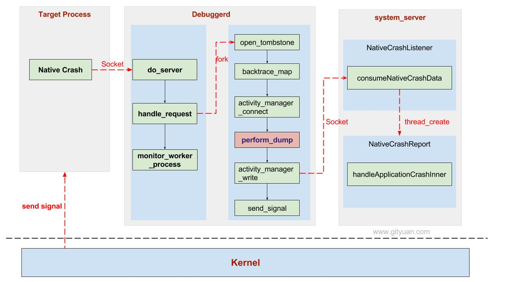

<script src="http://code.jquery.com/jquery-1.7.2.min.js"></script>
<script src="http://yandex.st/highlightjs/6.2/highlight.min.js"></script>
<script>hljs.initHighlightingOnLoad();</script>
<script type="text/javascript">
$(document).ready(function(){
$("h2,h3,h4,h5,h6").each(function(i,item){
var tag = $(item).get(0).localName;
$(item).attr("id","wow"+i);
$("#category").append('<a class="new'+tag+'" href="#wow'+i+'">'+$(this).text()+'</a></br>');
$(".newh2").css("margin-left",0);
$(".newh3").css("margin-left",20);
$(".newh4").css("margin-left",40);
$(".newh5").css("margin-left",60);
$(".newh6").css("margin-left",80);
});
});
</script>
<div id="category"></div>

# Native Crash流程
&emsp;&emsp;从系统全局来说，Crash分为Framework/App Crash， Native Crash，以及Kernel Crash。对于framework层或者app层的Crash(即Java层面Crash)，那么往往是通过抛出未捕获异常而导致的Crash，至于Kernel Crash，很多情况是发生Kernel panic，对于内核崩溃往往是驱动或者硬件出现故障。native crash则是由于bionic native中的程序发生异常引起的，其中最为常见的场景是SIGSEGV段错误异常，往往是内存出现异常，比如访问了权限不足的内存地址。
<br>&emsp;&emsp; 以下是Native Crash的处理流程：



## 第一章 __linker_init

&emsp;&emsp;了解native crash，首先从应用程序入口位于begin.S中的__linker_init入手。



&emsp;&emsp;begin.S()调用__linker_init(),而__Linker_init()调用了__Linker_init_post_relocation()，在方法relocation中，进行了系统环境清理以及系统属性初始化等工作，其中重点工作是debuggerd_init()。
<br>&emsp;&emsp;begin.S()调用__linker_init(),而__Linker_init()调用了__Linker_init_post_relocation()，在方法relocation中，进行了系统环境清理以及系统属性初始化等工作，其中重点工作是debuggerd_init()。
<br>&emsp;&emsp;在debuggerd_init()中定义了一个sigaction结构体action，进行初始化之后，将其函数sa_sigaction指针指向debuggerd_signal_handler()方法。
<br>&emsp;&emsp;当bionic上的native程序发生异常时，kernel会发送相应的signal；当进程捕获这个signal会通知debuggerd在crash之前调用ptrace来获取有价值的信息。
<br>&emsp;&emsp;在debuggerd_signal_handler()方法中，主要是执行了send_debuggerd_packet()这个重要方法，该方法中通过Mutex防止多个crashing线程同一时间来来尝试跟debuggerd进行通信，通过socket_abstract_client()建立与debuggerd的socket通道，将DEBUGGER_ACTION_CRASH消息发送给debuggerd服务端之后阻塞等待服务端的回复。

## 第二章 debuggerd服务端



&emsp;&emsp;debuggerd 守护进程启动后，一直在等待socket client的连接。当native crash发送后便会向debuggerd发送action = DEBUGGER_ACTION_CRASH的消息。
<br>&emsp;&emsp;debuggerd服务端read_quest()得到客户端的消息后，通过handle_request()方法fork()子进程，执行worker_process()来处理消息，如果fork()返回的是父进程，则父进程调用monitor_worker_process()来监控子进程的执行。
<br>&emsp;&emsp;worker_process()整个过程比较复杂，就只熟悉了attach_gdb=false的执行流程：
<br>&emsp;&emsp;（1）当DEBUGGER_ACTION_CRASH ，则调用open_tombstone并继续执行；
<br>&emsp;&emsp;（2）调用ptrace方法attach到目标进程，取来cpu、memory、traces等内容;
<br>&emsp;&emsp;（3）调用BacktraceMap::Create来生成backtrace;
<br>&emsp;&emsp;（4）当DEBUGGER_ACTION_CRASH，则执行activity_manager_connect，该方法的功能是建立跟上层ActivityManager的socket连接。对于”/data/system/ndebugsocket”的服务端是在NativeCrashListener.java方法中创建并启动的；
<br>&emsp;&emsp;（5）调用drop_privileges来取消特权模式；
<br>&emsp;&emsp;（6）通过perform_dump执行dump操作，当遇到SIGBUS等致命信号，则调用engrave_tombstone()输出tombstone，这是核心方法
<br>&emsp;&emsp;（7）调用activity_manager_write，将进程crash情况告知AMS；
<br>&emsp;&emsp;（8）调用ptrace方法detach到目标进程;
<br>&emsp;&emsp;（9）当DEBUGGER_ACTION_CRASH，发送信号SIGKILL给目标进程tid

## 第三章 AMS服务端（NativeCrashListener）

&emsp;&emsp;当发生native crash后，kernel发送信号给进程，进程通过socket连接到debuggerd，并阻塞等待debuggerd的回复。debuggerd调用ptrace attch到进程收集cpu、memory、traces，保存tombstone以及backtrace，并会向AMS客户端通过socket连接，并将pid、signal、traces信息发送给AMS，得到AMS的回复后，最终debuggerd发送SIGKILL到进程。
<br>&emsp;&emsp;AMS的服务端是在NativeCrashListener.java方法中创建并启动的，所以这部分需要了解NativeCrashListener.java。



&emsp;&emsp;当开机过程中启动服务启动到阶段PHASE_ACTIVITY_MANAGER_READY(550)，意味着服务可以广播自己的intents，然后通过startObservingNativeCrashes()启动native crash监听进程。
<br>&emsp;&emsp;NativeCrashListener 继承于Thread，可见它是一个线程，通过start()来启动。接下来是NativeCrashListener的run方法。
<br>&emsp;&emsp;NativeCrashListener的run方法中，创建了一个Socket监听来自具有root权限的进程，debuggerd是以root权限运行，因此可以与NativeCrashListener建立连接，然后通过consumeNativeCrashData(peerFd)来处理来自debuggerd的消息并返回处理结果给debuggerd。下面来看consumeNativeCrashData(peerFd)是如何处理消息的。
<br>&emsp;&emsp;consumeNativeCrashData(peerFd)读取debuggerd中的signal、pid、trace信息后，通过 (new NativeCrashReporter(pr, signal, reportString)).start();线程将native crash事件报告给framework层，通过handleApplicationCrashInner（）来处理crash。

>总结来说：
<br>&emsp;&emsp;system_server进程启动过程中，调用startOtherServices来启动各种其他系统Service时，也正是这个时机会创建一个用于监听native crash事件的NativeCrashListener对象(继承于线程)，通过socket机制来监听，等待debuggerd与该线程创建连接，收集signal、pid、trace信息后调用NativeCrashRepoter的AMS.handleApplicationCrashInner（）来处理crash，最终NativeCrashListener将处理结果返回给debuggerd。
<br>&emsp;&emsp;不论是Native crash还是framework crash最终都会调用到handleApplicationCrashInner()，这个方法是AMS真正处理debuggerd消息的地方。

<br>&emsp;&emsp;Native Crash 过程总结：



&emsp;&emsp;Native程序通过link连接后，当发生Native Crash时，则kernel会发送相应的signal，当进程捕获致命的signal，通知debuggerd调用ptrace来获取有价值的信息(这是发生在crash前)。

1. kernel 发送signal给target进程(包含native代码)；
2. target进程通过debuggerd_signal_handler，捕获signal；
>&emsp;&emsp;（1）建立于debuggerd进程的socket通道；
<br>&emsp;&emsp;（2）将action = DEBUGGER_ACTION_CRASH的消息发送给debuggerd服务端；
<br>&emsp;&emsp;（3）阻塞等待debuggerd服务端的回应数据。
3. debuggerd作为守护进程，一直在等待socket client的连接，此时收到action = DEBUGGER_ACTION_CRASH的消息；
4. 执行到handle_request时，通过fork创建子进程来执行各种dump相关操作；
5. 新创建的进程，通过socket与system_server进程中的NativeCrashListener线程建立socket通道，并向其发送native crash信息；
6. NativeCrashListener线程通过创建新的名为“NativeCrashReport”的子线程来执行AMS的handleApplicationCrashInner方法。

<br>&emsp;&emsp;这个流程图只是从整体来概要介绍native crash流程，其中有两个部分是核心方法：
>&emsp;&emsp;perform_dump是整个debuggerd的核心工作，该方法内部调用engrave_tombstone；
<br>&emsp;&emsp;AMS的handleApplicationCrashInner；

## 第四章 Crash处理流程
```java
AMS.handleApplicationCrashInner
AMS.EventLog.writeEvent
            AMS.addErrorToDropBox
            AMS.crashApplication
                AMS.makeAppCrashingLocked
                    AMS.startAppProblemLocked
                    ProcessRecord.stopFreezingAllLocked
                        ActivityRecord.stopFreezingScreenLocked
                            WMS.stopFreezingScreenLocked
                                WMS.stopFreezingDisplayLocked
                    AMS.handleAppCrashLocked
                mUiHandler.sendMessage(SHOW_ERROR_MSG)
```
&emsp;&emsp;handleApplicationCrashInner()的首先将crash信息保存到eventLog中，并将log信息存到dropbox中，最后调用crashApplication()处理crash。crashApplication()的工作是调用makeAppCrashingLocked()继续处理crash。
<br>&emsp;&emsp;makeAppCrashingLocked方法中调用startAppProblemLocked获取当前用户下的crash应用的error receiver并忽略当前app的广播接收，调用ProcessRecord.stopFreezingAllLocked停止进程里所有的activity：
```shell
处理屏幕旋转相关逻辑；
移除冻屏的超时消息；
屏幕旋转动画的相关操作;
使能输入事件分发功能；
display冻结时，执行gc操作；
更新当前的屏幕方向；
向mH发送configuraion改变的消息。
```
&emsp;&emsp;AMS.handleAppCrashLocked：
1.当同一进程在时间间隔小于1分钟时连续两次crash，则执行的情况下：
>&emsp;&emsp;（1）对于非persistent进程：
<br>&emsp;&emsp;ASS.handleAppCrashLocked(app);
<br>&emsp;&emsp;AMS.removeProcessLocked(app, false, false, “crash”);
<br>&emsp;&emsp;AMS.resumeTopActivitiesLocked();
&emsp;&emsp;
<br>&emsp;&emsp;（2）对于persistent进程，则只执行
<br>&emsp;&emsp;ASS.resumeTopActivitiesLocked();

2.否则执行
>ASS.finishTopRunningActivityLocked(app, reason);

&emsp;&emsp;对于并没有在一分钟之内发生两次crash的进程，则找到栈顶第一个不处于finishing状态的activity，将该activity设置为不可见，并调用activity的onPause()方法。
<br>&emsp;&emsp;如果同一个进程在一分钟之内发生了两次crash，需要分别考虑persistent进程和非persistent进程来进行相应的处理。
<br>&emsp;&emsp;对于persistent进程，则只执行ASS.resumeTopActivitiesLocked()来找到mTaskHistory栈中第一个未处于finishing状态的Activity，并调用activity的onResume()。
<br>&emsp;&emsp;对于非persistent进程，则（1）通过ASS.handleAppCrashLocked()遍历所有activities，找到位于该ProcessRecord的所有ActivityRecord，并结束该Acitivity。（2）AMS.removeProcessLocked，从mProcessNames移除该进程（移除ProcessRecord），kill进程并清空该进程相关联的组件。（3）AMS.resumeTopActivitiesLocked，找到mTaskHistory栈中第一个未处于finishing状态的Activity，回调应用onResume方法。
<br>&emsp;&emsp;最后，系统会弹出提示crash的对话框，并阻塞等待用户选择是“退出”或 “退出并报告”，当用户不做任何选择时5min超时后，默认选择“退出”，当手机休眠时也默认选择“退出”。
<br>&emsp;&emsp;补充：app、frameworks crash 的工作还没有结束，还会通过finnally语句块保证能执行并彻底杀掉Crash进程Process.killProcess(Process.myPid())，关于杀进程的过程。当Crash进程被杀后，并没有完全结束，还有Binder死亡通知的流程还没有处理完成。

```shell
Native Crash处理流程总结：
    crash的处理流程可以概述为，保存eventLog，保存log到dropbox，并且获得error receiver、忽略当前接收到的所有广播；
    停止进程中的所有activity；
    如果进程没有在一分钟crash两次，那么找到该进程中不处于finish状态的activity，调用其onPause方法；
    如果该进程在一分钟内crash了两次，那么需要根据进程是否属于persistent来区别对待，（1）AMS将会放弃persistent进程当前处于finish状态的activity，找到一个不finished的activity，并调用其onResume方法，（2）对于非persistent的进程，AMS会清空它的activity及关联的组件，移除ProcessRecord，然后找到mTaskHistory中没有finish的activity来onResume。
    最后，发送消息SHOW_ERROR_MSG，弹出提示crash的对话框，等待用户选择。最后，系统会弹出提示crash的对话框，并阻塞等待用户选择是“退出”或 “退出并报告”，当用户不做任何选择时5min超时后，默认选择“退出”，当手机休眠时也默认选择“退出”。
```
#
# 第五章 场景模拟
&emsp;&emsp;so库是在native层开发的，在使用so库时发生的crash即native crash，下面是一个访问空指针的jni方法：
```java
static void jni_lijiao_crashFunc(JNIEnv* env, jclass clazz)
{
int *p = 0;
*p = 1;
}
.......
static const JNINativeMethod method_table[] = {
{"crashFunc_native", "()V", (void*)jni_lijiao_crashFunc}
};
.......
```
&emsp;&emsp;然后在java层对这个jni方法进行调用，运行调用该jni方法的应用启动时，发生了闪退，从logcat的显示信息中可以看到以下关键信息：
```
01-02 18:41:02.866 3498 3498 I AEE_AED : signal 5 (SIGTRAP), code 1 (TRAP_BRKPT), fault addr 0x745809d3a4
01-02 18:41:02.866 3498 3498 I AEE_AED : x0 0000000000000032 x1 000000745e08da60 x2 0000000000000005 x3 0000000000000003
01-02 18:41:02.866 3498 3498 I AEE_AED : x4 000000000000006a x5 0000000000008000 x6 0000007463dbc000 x7 0000000000000000
01-02 18:41:02.866 3498 3498 I AEE_AED : x8 0000000000000000 x9 0000000000000032 x10 000000745e08dbf0 x11 0000000000000023
01-02 18:41:02.866 3498 3498 I AEE_AED : x12 0000000000000018 x13 0000000000000000 x14 0000000000000000 x15 002c59fb845c9553
01-02 18:41:02.866 3498 3498 I AEE_AED : x16 000000745fc6fa48 x17 0000007462c639c0 x18 000000745e08ccd7 x19 000000745f766800
01-02 18:41:02.866 3498 3498 I AEE_AED : x20 000000745809d384 x21 000000745f766800 x22 000000745e08e45c x23 0000007444ea27f2
01-02 18:41:02.866 3498 3498 I AEE_AED : x24 0000000000000008 x25 c9683bdfb0cce7b9 x26 000000745f766898 x27 c9683bdfb0cce7b9
01-02 18:41:02.867 3498 3498 I AEE_AED : x28 0000000000000002 x29 000000745e08e160 x30 000000745809d3a4
01-02 18:41:02.867 3498 3498 I AEE_AED : sp 000000745e08e160 pc 000000745809d3a4 pstate 0000000060000000
01-02 18:41:02.870 3498 3498 I AEE_AED :
01-02 18:41:02.870 3498 3498 I AEE_AED : backtrace:
01-02 18:41:02.870 3498 3498 I AEE_AED : #00 pc 00000000000323a4 /system/lib64/libandroid_servers.so
01-02 18:41:02.870 3498 3498 I AEE_AED : #01 pc 000000000127a424 /data/dalvik-cache/arm64/system@framework@services.jar@classes.dex (offset 0x1192000)
```
native crash的问题定位与分析知识点较多，这部分的内容后续了解。


