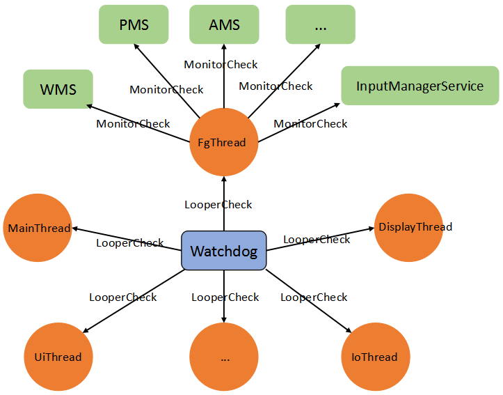
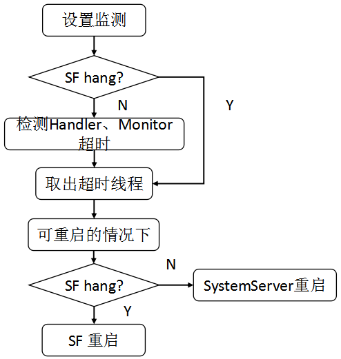
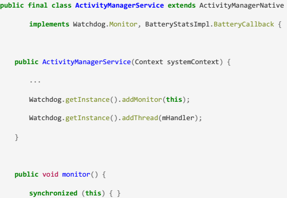

<script src="http://code.jquery.com/jquery-1.7.2.min.js"></script>
<script src="http://yandex.st/highlightjs/6.2/highlight.min.js"></script>
<script>hljs.initHighlightingOnLoad();</script>
<script type="text/javascript">
$(document).ready(function(){
$("h2,h3,h4,h5,h6").each(function(i,item){
var tag = $(item).get(0).localName;
$(item).attr("id","wow"+i);
$("#category").append('<a class="new'+tag+'" href="#wow'+i+'">'+$(this).text()+'</a></br>');
$(".newh2").css("margin-left",0);
$(".newh3").css("margin-left",20);
$(".newh4").css("margin-left",40);
$(".newh5").css("margin-left",60);
$(".newh6").css("margin-left",80);
});
});
</script>
<div id="category"></div>

# WatchDog 原理及案例分析
&emsp;&emsp;Android系统中，有硬件WatchDog用于定时检测关键硬件是否正常工作，类似的，在framework层有一个软件WatchDog用于定期检测关键系统服务是否发生死锁事件。WatchDog功能主要是分析系统核心服务和重要线程是否处于Blocked状态。
1. 监视reboot广播；
2. 监视Monitor关键系统服务是否死锁；

## 第一章 Watchdog 工作原理

Watchdog的总体框图:



&emsp;&emsp;watchdog在创建时会初始化很多HandlerCheck，例如前台线程、I/O线程、主线程、display线程、UI线程的HandlerCheck。HandlerCheck对象可分为两类:
>&emsp;&emsp;(1)Monitor Checker：用于检查Monitor对象可能发生的死锁。（FgThread）
<br>&emsp;&emsp;(2)Looper Checker：用于检查消息队列是否长期处于工作状态。（MainThread、DisplayThread、UIThread、IOThread、FgThread）

&emsp;&emsp;Monitor Checker提醒我们不能长期持有重要服务的对象锁，否则会阻塞很多函数的运行；Looper Checker提醒我们不能长期霸占消息队列，否则其他的消息得不到处理。这两类都会造成SNR。
<br>&emsp;&emsp;watchdog的超时监测以监测surfaceflinger优先，整体流程如下：



### 1.1 Watchdog 创建
**Watchdog.java:**
```java
private Watchdog() {
super("watchdog");
// Initialize handler checkers for each common thread we want to check. Note
// that we are not currently checking the background thread, since it can
// potentially hold longer running operations with no guarantees about the timeliness
// of operations there.

// The shared foreground thread is the main checker. It is where we
// will also dispatch monitor checks and do other work.
mMonitorChecker = new HandlerChecker(FgThread.getHandler(),
"foreground thread", DEFAULT_TIMEOUT);
mHandlerCheckers.add(mMonitorChecker);
// Add checker for main thread. We only do a quick check since there
// can be UI running on the thread.
mHandlerCheckers.add(new HandlerChecker(new Handler(Looper.getMainLooper()),
"main thread", DEFAULT_TIMEOUT));
// Add checker for shared UI thread.
mHandlerCheckers.add(new HandlerChecker(UiThread.getHandler(),
"ui thread", DEFAULT_TIMEOUT));
// And also check IO thread.
mHandlerCheckers.add(new HandlerChecker(IoThread.getHandler(),
"i/o thread", DEFAULT_TIMEOUT));
// And the display thread.
mHandlerCheckers.add(new HandlerChecker(DisplayThread.getHandler(),
"display thread", DEFAULT_TIMEOUT));
// Initialize monitor for Binder threads.
addMonitor(new BinderThreadMonitor());
//if (SystemProperties.get("ro.have_aee_feature").equals("1")) {
exceptionHWT = new ExceptionLog();
//}

}
```
&emsp;&emsp;watchdog被创建之后再调用start（）就可被作为一个单独的线程运行在进程中了，但是，还不够，因为AMS、PMS等核心系统服务还没添加到watchdog的监测集（需要watchdog关注的对象）中。需要注意的是watchdog是采用单例模式的思想设计的，整个系统中只有一个watchdog实例。

### 1.2 添加watchdog监测对象
&emsp;&emsp;watchdog有两种方式，用来添加Monitor Checker和Looper Checker对象：
```java
public void addMonitor(Monitor monitor) {
synchronized (this) {
if (isAlive()) {
throw new RuntimeException("Monitors can't be added once the Watchdog is running");
}
mMonitorChecker.addMonitor(monitor);
}
}
..............
public void addThread(Handler thread, long timeoutMillis) {
synchronized (this) {
if (isAlive()) {
throw new RuntimeException("Threads can't be added once the Watchdog is running");
}
final String name = thread.getLooper().getThread().getName();
mHandlerCheckers.add(new HandlerChecker(thread, name, timeoutMillis));
}
}
```
&emsp;&emsp;实际上addThread（）是将当前线程添加到watchdog的HandlerCheck列表中，addMonitor（）是将当前线程添加到watchdog的Handlercheck对象的Monitor列表中。被watchdog监测的对象，都需要自己主动添加到watchdog的监测集中。以下是AMS构造器片段：



&emsp;&emsp;AMS继承了Watchdog中的Monitor，并实现了monitor方式。可以看到AMS需要被监测自己是否死锁了，监测消息队列是否被长期霸占。（整个Android系统被monitor的并不多，十个左右）。

### 1.3 watchdog的监测机制
&emsp;&emsp;watchdog是一个线程，当调用start（）方法时，就会从run（）方法开始执行。
```java
public void run() {
boolean waitedHalf = false;
while (true) {
final ArrayList<HandlerChecker> blockedCheckers;
final String subject;
final boolean allowRestart;
int debuggerWasConnected = 0;
synchronized (this) {
long timeout = CHECK_INTERVAL; //CHECK_INTERVAL=30s
for (int i=0; i<mHandlerCheckers.size(); i++) {
HandlerChecker hc = mHandlerCheckers.get(i);
//执行所有的Checker的监控方法, 每个Checker记录当前的mStartTime
hc.scheduleCheckLocked();
}

if (debuggerWasConnected > 0) {
debuggerWasConnected--;
}

long start = SystemClock.uptimeMillis();
//通过循环,保证执行30s才会继续往下执行
while (timeout > 0) {
if (Debug.isDebuggerConnected()) {
debuggerWasConnected = 2;
}
try {
wait(timeout); //触发中断,直接捕获异常,继续等待.
} catch (InterruptedException e) {
Log.wtf(TAG, e);
}
if (Debug.isDebuggerConnected()) {
debuggerWasConnected = 2;
}
timeout = CHECK_INTERVAL - (SystemClock.uptimeMillis() - start);
}

//评估Checker状态
final int waitState = evaluateCheckerCompletionLocked();
if (waitState == COMPLETED) {
waitedHalf = false;
continue;
} else if (waitState == WAITING) {
continue;
} else if (waitState == WAITED_HALF) {
if (!waitedHalf) {
//首次进入等待时间过半的状态
ArrayList<Integer> pids = new ArrayList<Integer>();
pids.add(Process.myPid());
//输出system_server和3个native进程的traces
ActivityManagerService.dumpStackTraces(true, pids, null, null,
NATIVE_STACKS_OF_INTEREST);
waitedHalf = true;
}
continue;
}
... //进入这里，意味着Watchdog已超时
}
...
}
}
```
1. watchdog监测是一个死循环。
2. 首先watchdog遍历HandlerCheck对象列表，并调用HandlerCheck对象的scheduleCheckLocked()方法，在这个方法中，记录下此时的开始时间，将HandlerCheck对象（implements Runable，因此是一个runable线程）添加到消息队列中。实际上在这里做了一个设置监测的工作。
3. 等待CHECK_INTERVAL（30s）再继续执行。
4. 执行evaluateCheckerCompletionLocked();返回HandlerCheck对象列表中，返回state值最大的state：（开始监测）当检查状态是已完成，或者是等待时间只有超时阈值的一半以内，则重新设置监测并检查超时。
> &emsp;&emsp;COMPLETED = 0：已经检查完成
<br>&emsp;&emsp;WAITING = 1：等待时间小于DEFAULT_TIMEOUT的一半，即30s；
<br>&emsp;&emsp;WAITED_HALF = 2：等待时间处于30s~60s之间；
<br>&emsp;&emsp;OVERDUE = 3：等待时间大于或等于60s。默认超时DEFAULT_TIMEOUT是一分钟（在初始化HandlerCheck对象时设置的），但是超时阈值可以设置，例如PMS的超时为十分钟。
5. 如果等待时间首次超过了超时时间的一半，则输出进程的traces信息，并重新设置监测并检测超时：
>&emsp;&emsp;ActivityManagerService.dumpStackTraces（）;
<br>&emsp;&emsp;trace信息保存在data/anr/traces.txt中。

<br>**scheduleCheckLocked()方法：**
```java
public final class HandlerChecker implements Runnable {
...
public void scheduleCheckLocked() {
if (mMonitors.size() == 0 && mHandler.getLooper().getQueue().isPolling()) {
mCompleted = true; //当目标looper正在轮询状态（空闲）则返回。
return;
}

if (!mCompleted) {
return; //有一个check正在处理中，则无需重复发送
}
mCompleted = false;

mCurrentMonitor = null;
// 记录当下的时间
mStartTime = SystemClock.uptimeMillis();
//发送消息，插入消息队列最开头， 见下方的run()方法
mHandler.postAtFrontOfQueue(this);
}

public void run() {
final int size = mMonitors.size();
for (int i = 0 ; i < size ; i++) {
synchronized (Watchdog.this) {
mCurrentMonitor = mMonitors.get(i);
}
//回调具体服务的monitor方法
mCurrentMonitor.monitor();
}

synchronized (Watchdog.this) {
mCompleted = true;
mCurrentMonitor = null;
}
}
}
```
&emsp;&emsp;如果Handlercheck对象的monitor列表为空（Looper Checker）&& 消息队列没有需要处理的消息，则mCompleted = true并返回，mCompleted是HandlerCheck的成员，当Handercheck对象属于需要被monitor的，或者是消息队列可能被长期霸占，就将该值置为false，检查完毕之后再置为true。
<br>&emsp;&emsp;因为watchdog是死循环，并且Handlercheck对象的检查是异步的，因此接下来首先要判断当前Handlercheck对象检查完毕否。
<br>&emsp;&emsp;在记录下当前检查开始的时间后，Handlercheck对象中的Handler对象会将Handlercheck添加到消息队列的队首，当被处理时从run（）方法开始执行。
<br>&emsp;&emsp;run（）方法中，遍历HandlerCheck对象中的Monitor对象列表，并调用Monitor对象的monitor（）方法。
<br>&emsp;&emsp;Handlercheck对象在添加到消息队列中后，有两种情况可能发生：Handlercheck对象一直得不到处理、Handlercheck对象的锁被其他对象长期持有无法执行monitor（）方法.

### 1.4 watchdog信息收集
```java
public void run() {
while (true) {
synchronized (this) {
...
//获取被阻塞的checkers
blockedCheckers = getBlockedCheckersLocked();
// 获取描述信息
subject = describeCheckersLocked(blockedCheckers);
allowRestart = mAllowRestart;
}

EventLog.writeEvent(EventLogTags.WATCHDOG, subject);

ArrayList<Integer> pids = new ArrayList<Integer>();
pids.add(Process.myPid());
if (mPhonePid > 0) pids.add(mPhonePid);
//第二次以追加的方式，输出system_server和3个native进程的栈信息
final File stack = ActivityManagerService.dumpStackTraces(
!waitedHalf, pids, null, null, NATIVE_STACKS_OF_INTEREST);

//系统已被阻塞1分钟，也不在乎多等待2s，来确保stack trace信息输出
SystemClock.sleep(2000);

if (RECORD_KERNEL_THREADS) {
//输出kernel栈信息
dumpKernelStackTraces();
}

//触发kernel来dump所有阻塞线程
doSysRq('l');

//输出dropbox信息
Thread dropboxThread = new Thread("watchdogWriteToDropbox") {
public void run() {
mActivity.addErrorToDropBox(
"watchdog", null, "system_server", null, null,
subject, null, stack, null);
}
};
dropboxThread.start();

try {
dropboxThread.join(2000); //等待dropbox线程工作2s
} catch (InterruptedException ignored) {
}

IActivityController controller;
synchronized (this) {
controller = mController;
}
if (controller != null) {
//将阻塞状态报告给activity controller，
try {
Binder.setDumpDisabled("Service dumps disabled due to hung system process.");
//返回值为1表示继续等待，-1表示杀死系统
int res = controller.systemNotResponding(subject);
if (res >= 0) {
waitedHalf = false;
continue; //设置ActivityController的某些情况下,可以让发生Watchdog时继续等待
}
} catch (RemoteException e) {
}
}

//当debugger没有attach时，才杀死进程
if (Debug.isDebuggerConnected()) {
debuggerWasConnected = 2;
}
if (debuggerWasConnected >= 2) {
Slog.w(TAG, "Debugger connected: Watchdog is *not* killing the system process");
} else if (debuggerWasConnected > 0) {
Slog.w(TAG, "Debugger was connected: Watchdog is *not* killing the system process");
} else if (!allowRestart) {
Slog.w(TAG, "Restart not allowed: Watchdog is *not* killing the system process");
} else {
Slog.w(TAG, "*** WATCHDOG KILLING SYSTEM PROCESS: " + subject);
//遍历输出阻塞线程的栈信息
for (int i=0; i<blockedCheckers.size(); i++) {
Slog.w(TAG, blockedCheckers.get(i).getName() + " stack trace:");
StackTraceElement[] stackTrace
= blockedCheckers.get(i).getThread().getStackTrace();
for (StackTraceElement element: stackTrace) {
Slog.w(TAG, " at " + element);
}
}
Slog.w(TAG, "*** GOODBYE!");
//杀死进程system_server
Process.killProcess(Process.myPid());
System.exit(10);
}
waitedHalf = false;
}
}
```
&emsp;&emsp;（1）在watchdog的死循环中，如果发现被监测的线程超时了，随后则调用getBlockedCheckersLocked（）将阻塞的HandlerCheck放在一个列表（blockedCheckers）中。并调用describeCheckersLocked(blockedCheckers)获取所有超时HandlerCheck的描述信息:
```java
//非前台线程进入该分支
if (mCurrentMonitor == null) {
return "Blocked in handler on " + mName + " (" + getThread().getName() + ")";
//前台线程进入该分支
} else {
return "Blocked in monitor " + mCurrentMonitor.getClass().getName()
+ " on " + mName + " (" + getThread().getName() + ")";
}
```
<br>&emsp;&emsp;（2）以追加的方式，输出进程的栈信息:ActivityManagerService.dumpStackTraces（，，，，），（在超过超时阈值一半时会先保存部分的进程栈信息）,调用需要保存栈信息的进程（调用watchdog的进程+以下）：
```java
public static final String[] NATIVE_STACKS_OF_INTEREST = new String[] {
"/system/bin/audioserver",
"/system/bin/cameraserver",
"/system/bin/drmserver",
"/system/bin/mediadrmserver",
"/system/bin/mediaserver",
"/system/bin/sdcard",
"/system/bin/surfaceflinger",
"media.codec", // system/bin/mediacodec
"media.extractor", // system/bin/mediaextractor
"com.android.bluetooth", // Bluetooth service
};
```
<br>&emsp;&emsp;（3）输出kernel的栈信息：dumpKernelStackTraces()
<br>&emsp;&emsp;（4）doSysRq('w');等价于echo w > /proc/sysrq-trigger转储处于uninterruptable阻塞状态的任务.doSysRq('l');等价于echo l > /proc/sysrq-trigger Show backtrace of all active CPUs
<br>&emsp;&emsp;（5）输出dropbox信息（logcat的历史日志）到/data/system/dropbox
mActivity.addErrorToDropBox（）
<br>&emsp;&emsp;（6）将阻塞报告给IActivityController
>&emsp;&emsp;int res = controller.systemNotResponding(subject);
<br>&emsp;&emsp;//subject为所有阻塞线程的描述信息
<br>&emsp;&emsp;返回值res决定了是否kill进程，-1为kill，1为不kill。

<br>&emsp;&emsp;（7）当debugger not attch （不在调试状态调试），IActivityController的返回值为-1，且allowRestart为允许时：
> &emsp;&emsp;遍历输出阻塞线程的栈信息；
<br>&emsp;&emsp;Process.killProcess(Process.myPid())，通过给目标进程发送信号9来kill进程。

信息收集总结：
1. 收集超时线程的描述信息，并写到eventlog中；
2. AMS.dumpStackTraces：输出Java和Native进程traces.txt；
3. WD.dumpKernelStackTraces：输出Kernel栈信息；
4. doSysRq：保存不可中断的阻塞线程（l），显示cpu的回溯
5. 输出dropBox
6. 遍历输出阻塞线程的栈信息后，重启systemserver进程。
ps：systemserver进程重启导致zygote重启，zygote重启导致media和netd及zygote的子进程重启。

## 第二章 日志获取
&emsp;&emsp;Android有很多获取日志的方式，watchdog产生的问题比较复杂，对日志的要求比较高，有的还和系统环境有关系，以下罗列出获取android日志的一些方式，在某些场景下，watchdog问题需要以下全部日志：Logcat、dumpsys、traces、binder、dropbox、tombstone、bugreport。
<br>&emsp;&emsp;（1）logcat。通过adb logcat命令输出android的当前运行日志，可以通过logcat -b指定要输出的日志缓冲区，缓冲区对应的是logcat的日志类型，高版本的logcat可以使用logcat -b all输出所有的缓冲区日志。
>&emsp;&emsp;event:通过android.until.EventLog工具类打印的日志，一些重要的系统事件都使用此类日志。
<br>&emsp;&emsp;main。通过android.util.Log工具类打印的日志，应用程序，尤其是基于SDK的应用程序会使用此类日志。
<br>&emsp;&emsp;system。通过android.util.SLog工具类打印的日志，系统相关的事件都会使用此类日志，例如SystemServer。
<br>&emsp;&emsp;radio。使用android.util.RLog工具类打印的日志。通信模块相关的日志都是使用此类日志，例如RIL。

&emsp;&emsp;（2）dumpsys。通过adb dumpsys输出一些重要的系统服务信息，例如，内存、电源、磁盘（待详细）。
<br>&emsp;&emsp;（3）traces。记录了一个时间段内的函数调用栈信息，通常会在发生ANR时触发打印各进程的函数调用栈。可以通过adb shell kill -3 [pid]来指定想要打印的进程的函数调用栈，traces信息保存在“data/anr/traces.txt”中。（kill -3的含义是向进程发送信号3，调用SIGNAL_QUIT（3），但是并不会导致进程退出）。
<br>&emsp;&emsp;（4）binder。跨进程调用的日志。可通过adb shell cat 从proc/binder下取出相应的日志：
```shell
failed_transact_log
transaction_log
transactions
stats
```
&emsp;&emsp;（5）dropbox。为了存储历史的logcat日志，android引入了dropbox，将历史日志持久化到磁盘中（data/system/dropbox）。logcat的缓冲区大小有限，所以需要循环利用，当空间不够时，旧的历史log就会被冲掉，尤其是在执行一些自动化测试时，需要长时间的运行，历史的log都需要保存下来。
<br>&emsp;&emsp;（6）tombtone。tombtone一般由虚拟机或者是native代码导致的错误，当发生tombtone，内核会上报一个严重的警告信号，上层收到信号后，会将当前的调用栈信息持久化到“data/tombtone”
<br>&emsp;&emsp;（7）bugreport。通过命令 adb bugreport命令输出。其中的日志内容非常多，logcat、dumpsys、traces、binder都包含在其中。由于输出bugreport的时间很长，当系统发生错误时，去输出bugreport已经来不及了，（可能系统此时已经重启了）。因此，使用bugreport就需要结合一些其他机制，例如杀掉system_server前先让bugreport运行完。

## 第二章 案例分析
&
emsp;&emsp;如果Android系统出现卡住，不响应任何操作，然后开始从`bootanimation`开始重启的情况，那么有可能发生了Watchdog监测超时。
<br>&emsp;&emsp;定位问题从查看日志开始，Watchdog出现的日志很明显，在logcat的`eventLog`和`systemLog`中都有出现，可以先从搜索关键字Watchdog开始。如果出现Watchdog监测超时这么重要的系统事件，android会打印出一个eventLog：
```shell
Watchdog:Blocked in handler xxx #表示HandlerChecker超时了
Watchdog:Blocked in monitor xxx #表示MonitorCheker超时了
```
&emsp;&emsp;systemLog中也会有部分信息：
```shell
Watchdog: *** WATCHDOG KILLING SYSTEM PROCESS: Blocked in monitor xxx, Blocked in xxx
Watchdog: xxx
Watchdog: *** GOODBYE!
```
&emsp;&emsp;出现了以上信息，可以断定是因为发生了Watchdog超时。我们先通过在logcat中检索关键字watchdog来看相关信息：
```shell
01-01 21:03:54.473 11482 12117 E Watchdog: **SWT happen **Blocked in monitor com.android.server.am.ActivityManagerService on foreground thread (android.fg)
01-01 21:03:58.781 11482 12117 I Watchdog_N: dumpKernelStacks
01-01 21:03:59.003 11482 12117 V Watchdog: ** save all info before killnig system server **
01-01 21:03:59.003 11482 12117 I ActivityManager: addErrorToDropBox system_server watchdog
01-01 21:03:59.486 11482 12117 D AES : onEndOfErrorDumpThread: system_server_watchdog Process: system_server
01-01 21:03:59.649 11482 12117 D AES : cause : system_server_watchdog
01-01 21:03:59.706 11482 12117 W Watchdog: *** WATCHDOG KILLING SYSTEM PROCESS: Blocked in monitor com.android.server.am.ActivityManagerService on foreground thread (android.fg)
01-01 21:03:59.706 11482 12117 W Watchdog: foreground thread stack trace:
01-01 21:03:59.706 11482 12117 W Watchdog: at java.lang.Object.wait(Native Method)
01-01 21:03:59.706 11482 12117 W Watchdog: at java.lang.Object.wait(Object.java:407)
01-01 21:03:59.706 11482 12117 W Watchdog: at com.android.server.am.ActivityManagerService.monitor(ActivityManagerService.java:23734)
01-01 21:03:59.706 11482 12117 W Watchdog: at com.android.server.Watchdog$HandlerChecker.run(Watchdog.java:205)
01-01 21:03:59.706 11482 12117 W Watchdog: at android.os.Handler.handleCallback(Handler.java:836)
01-01 21:03:59.706 11482 12117 W Watchdog: at android.os.Handler.dispatchMessage(Handler.java:103)
01-01 21:03:59.706 11482 12117 W Watchdog: at android.os.Looper.loop(Looper.java:203)
01-01 21:03:59.706 11482 12117 W Watchdog: at android.os.HandlerThread.run(HandlerThread.java:61)
01-01 21:03:59.706 11482 12117 W Watchdog: at com.android.server.ServiceThread.run(ServiceThread.java:46)
01-01 21:03:59.706 11482 12117 W Watchdog: *** GOODBYE!
```
&emsp;&emsp;根据日志中的：
```
01-01 21:03:54.473 11482 12117 E Watchdog: **SWT happen **Blocked in monitor com.android.server.am.ActivityManagerService on foreground thread (android.fg)
```
&emsp;&emsp;我们可以判断出：android.fd线程通过AMS.Monitor()方法得不到AMS的对象锁，导致android.fd线程等待超时；
<br>&emsp;&emsp;根据日志中的：
```
01-01 21:03:59.706 11482 12117 W Watchdog: *** WATCHDOG KILLING SYSTEM PROCESS: Blocked in monitor
```
&emsp;&emsp;我们可以判断出：Watchdog重启了SystemServer；

<br>&emsp;&emsp;知道了是哪些线程发生了超时，就可以查看`data/anr/traces.txt`中`SystemServer`进程的trace来进行进一步分析。在traces信息中检索`android.fd`，可以发现android.fd的函数调用栈：
```
"android.fg" prio=5 tid=18 TimedWaiting
| group="main" sCount=1 dsCount=0 obj=0x12d75c40 self=0x78ba05ac00
| sysTid=1266 nice=-2 cgrp=default sched=0/0 handle=0x78ad168450
| state=S schedstat=( 6732383 440233 21 ) utm=0 stm=0 core=0 HZ=100
| stack=0x78ad066000-0x78ad068000 stackSize=1037KB
| held mutexes=
at java.lang.Object.wait!(Native method)
- waiting on <0x04f61673> (a com.android.server.am.ActivityManagerService)
at java.lang.Object.wait(Object.java:407)
at com.android.server.am.ActivityManagerService.monitor(ActivityManagerService.java:23732)
- locked <0x04f61673> (a com.android.server.am.ActivityManagerService)
at com.android.server.Watchdog$HandlerChecker.run(Watchdog.java:205)
at android.os.Handler.handleCallback(Handler.java:836)
at android.os.Handler.dispatchMessage(Handler.java:103)
at android.os.Looper.loop(Looper.java:203)
at android.os.HandlerThread.run(HandlerThread.java:61)
at com.android.server.ServiceThread.run(ServiceThread.java:46)
```
&emsp;&emsp;从android.fg的调用栈我们可以看出：android.fg正处于TIMED_WAITING状态，处于这种状态一般来说，是该线程正在调用wait(long)或者join(long)。从上面的调用栈可知，AMS方法在调用monitor()方法时持有了锁<0x04f61673>，然后执行了wait()，导致Watchdog检查超时。


